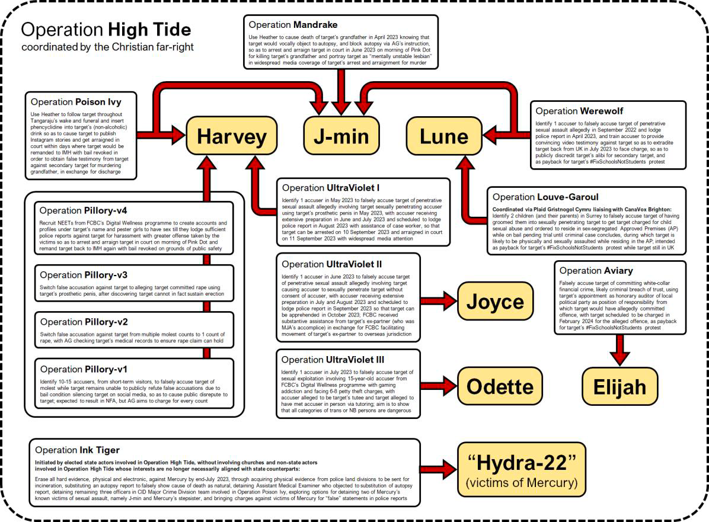

# [NEW: Letters for Singapore](/letters)

The protest is over, but we need to keep the momentum going. Help us make your voice heard by writing in to your nearest Singapore Consulate. Read more [here](/letters).

# Call to action

International coverage, protests, and other forms of public action are vital to make sure that the Singapore government stops ignoring the situation described in this site and trying to sweep the matter under the carpet. If they are unwilling or unable to confront the Christian far-right head-on, even at risk of the ruin of their own country and to the jeopardy of their own people, everyone who can recognize the real threat that fascism poses to the world must take a firm stand.

**Draw attention to Operation High Tide.** It must not be buried. Fascism cannot be debated or pacified. It must be destroyed before it becomes emboldened.

**Speak Harvey's truth to power.** We do not want another trans woman broken, smeared, scapegoated or dead. Enough is enough. We want safety for Harvey and justice for Harvey – before it's too late.

Help in any way that you can. Be creative. Be collaborative.

Solidarity with Harvey, Singapore, Queer people everywhere, people all over the world battling fascism. All power to all people.

# What is this site?

This site is in solidarity with Queer people worldwide, whose lives are being threatened by various fascist regimes, organizations, parties, groups or individuals.

This site aims to synthesize and summarize available information online related to **Operation High Tide**.

Operation High Tide is an attempt by several Christofascist, evangelical organizations based in America to influence public policy and legislation in Singapore (a country in Southeast Asia), through their respective networks located in Singapore.

**CW for the site as a whole:** Rape, child sexual abuse, revenge porn, homophobia/transphobia, murder, stalking, religious extremism, Christofascism

# How to read this site
The content of this site is long, as the history of this situation is both long and dense. It is not necessary to understand all the details of the situation; you may engage with the contents of this site as it interests you.

The [next section](#overview-of-the-situation) provides a brief overview of the situation. The [section after that](#operation-high-tide) explains Operation High Tide. These are the most important sections to read. After that, you can peruse 
[Summary of key persons and events](#summary-of-key-persons-and-events) to fill in any gaps in your knowledge if you wish. It is in approximately chronological order, so content at the end of the section is the most recent and urgent.

This site ends with two in-depth commentaries on the socio-political and geopolitical aspects of Operation High Tide and Christofascism.

# Overview of the situation
**Mercury Jamie Alice (Mercury)** is a serial harasser and abuser. **Vickreman Harvey Chettiar (Harvey)** is an autistic Tamil woman who has suffered much alienation and systemic injustice in her life. Mercury and Harvey were friends from 2019 to 2021; the friendship ended when Harvey [failed to/refused to](https://twitter.com/Justice4Harvey/status/1675856323999825920) help Mercury with certain matters, including Mercury's [anthrax hoax](https://www.todayonline.com/singapore/youth-charged-false-anthrax-attack-bedok-1907586), and Mercury betrayed Harvey.

On 18 June 2022, an action called [**Brown Dot**](https://victimsofmalice.com/our-first-statement-overview-of-the-situation/#pink-dot-2022) included advocacy for Harvey. Mercury then started harassing, impersonating, stalking, sending death threats to and spreading revenge porn of the people at Brown Dot who had advocated for Harvey.

The main victims of Mercury then began seeking legal recourse, including applying for protection orders. Mercury thus [started attending](https://ipfs.thirdwebcdn.com/ipfs/QmRLtnEtCHK8tUtVHw5hKiH5KNru3Ypg4f8JPJyo5Gi2Gv/) **Cornerstone Community Church** for assistance. Mercury claimed to be a _detransitioner_ who was being framed for all these crimes by her LGBTQ+ victims, and that her victims were persecuting her for detransitioning. Mercury thus got pulled into the Christian far-right operation, [**Operation High Tide**](#operation-high-tide).

The Christian far-right have been attempting to silence or discredit the victim-witnesses to Mercury's crimes, some of whom are LGBTQ+, others of whom are not. An example of their fascist tactics includes psychologically destroying Harvey by getting her remanded for pre-trial detention in prison (which can last for [years](https://www.instagram.com/p/Csay1gvOXFB/)), where she would be placed in the male section, ["so that she will not be able to testify coherently and/or reliably in any criminal or quasi-civil Court case"](https://victimsofmalice.com/mandrake-werewolf-poison-ivy/). Another example includes [framing J-min for the murder of her own grandfather](https://victimsofmalice.com/lucien-wong-easter-surprise-murder/), whose death was actually claimed by Mercury as a [murder](https://victimsofmalice.com/mercury-claims-9th-murder-jia-mins-grandfather/). As a result, J-min is in the U.K. [seeking asylum](https://twitter.com/jminwong/status/1669702139885518852), due to [persecution](https://sittingonthetrain.substack.com/p/hard-launching-my-refugee-sob-story) by Christofascists in Singapore. Mercury essentially dragged in the Christian far-right into her mid-sized game, and now they are the ones calling the big shots in their larger war.

The threats continue: **Lune Loh**, a victim of Mercury who is studying in the U.K., also had to consider asylum, but there is a plot to frame her for child sexual grooming in the U.K., [also instigated by the Witherspoon Institute](https://victimsofmalice.com/operation-louve-garoul/).

Meanwhile, multiple quarters of the Singapore state, rather than investigating and prosecuting the perpetrators, seem to be covering up the situation to prevent reputational damage. Prime Minister Lee Hsien Loong assented to [Operation Ink Tiger](#operation-ink-tiger) to destroy evidence of Mercury's crimes, delegating away his authority over the Internal Security Department (ISD) to carry it out — just as ISD had framed Harvey a decade ago in [Operation Providence](#prelude-operation-providence) to coerce her into framing and silence a nosy opposition politician, for the purpose of covering up the state's mismanagement of the population's compulsory retirement funds.

Fascist targeting and persecution will not stop at Mercury's victims. It will not stop with trans people. It will not stop with LGBTQ+ people. It will not stop at Singapore. It will not stop at Florida, Mississippi, North Dakota, Tennessee, Montana, Iowa or Indiana. "First they came..." [Just read the fucking poem.](https://www.hmd.org.uk/resource/first-they-came-by-pastor-martin-niemoller/)

List of people of note:
1. Mercury (and her girlfriends and accomplices Heather and Rena)
2. Harvey
3. Victims of Mercury: Carissa, J-min, Lune, Joyce, Tobias, Mercury's ex-girlfriend, Mercury's ex-girlfriend's ex-boyfriend
4. Syafik, Harvey's rapist
5. Church figures involved in Operation High Tide: Carol Loi (CanaVox, Focus on the Family Singapore), Lawrence & Nina Khong (Faith Community Baptist Church), Thio family, 3:16 Church, Cornerstone Community Church, Church of our Saviour
6. Government (or adjacent, e.g. legal) figures involved in Operation High Tide: Tan Chuan-Jin, Indranee Rajah, Gan Kim Yong, Seah Kian Peng, Lucien Wong

# Operation High Tide
**Operation High Tide** is directly supported by three organizations in the U.S.:
1. The Witherspoon Institute [[x](https://winst.org/)] [[x](https://www.influencewatch.org/non-profit/witherspoon-institute/)] [[x](https://www.dailyprincetonian.com/article/2023/05/princeton-opinion-james-madison-program-funding-ideology)] [[x](https://ipscell.com/2012/01/secrets-of-the-wingnut-witherspoon-gang/)] [[x](https://www.thepinknews.com/2020/06/03/lgb-alliance-gary-powell-center-bioethics-culture-alliance-defending-freedom-anti-lgbt/)]
2. CanaVox [[x](https://canavox.com/our-reading-groups/groups-near-me/)] [[x](https://winst.org/canavox/)] [[x](https://www.reddit.com/r/Christianity/comments/hrj54y/experience_with_canavox/?rdt=53990)] [[x](https://www.rightwingwatch.org/post/anti-lgbt-latina-mama-packs-a-lot-of-stereotypes-into-message-to-pete-buttigieg/)][[x](https://www.vice.com/en/article/3k8qmw/uncovering-the-christian-think-tanks-behind-the-bogus-studies-on-gay-parenting)]
3. Global Rainbow Crossers Alliance [[x](https://www.taipeitimes.com/News/feat/archives/2019/12/19/2003727797)] [[x](https://equal-eyes.org/database/2019/12/20/taipei-rainbow-crossing-conversion-therapy-by-another-name)]

The ultimate goal of Operation High Tide is "to turn society as a whole against [transgender persons] and other LGBTQs, and get these “perversions” criminally punishable". This parallels Christofascist efforts to push their anti-Queer agenda domestically (on a state and federal level), as they've tried to ideologically and materially institute Christian nationalism in the U.S.

Operation High Tide also parallels their attempts, or even successes, in Ghana, Kenya, Nigeria and Uganda.

> Though Ghanaian evangelicals were the driving force behind the proposed legislation, the influence of the U.S. Christian right is evident – and Ghana is just one of many countries where conservative Christian activists, in particular evangelical groups, have sought to remake the world in line with their religious beliefs and political ideology. Indeed, evangelical groups have played an increasingly powerful role in world affairs since the 1970s, shaping U.S. foreign relations as well as laws and culture in countries around the world.
> 
> —*Lauren Frances Turek (2022), ["U.S. Evangelicals Are a Foreign Policy Force to Be Reckoned With"](https://www.worldpoliticsreview.com/evangelicals-us-foreign-policy-religious-freedom/), World Politics Review*

In Singapore's context, Operation High Tide aims to:
1. have **healthcare policy** amended so that being transgender is classified as a mental illness, warranting institutionalization until one's mental illness of "transgenderism" is "cured".
2. have **legislation** altered so that "transgenderism" is criminalized, and "repeat offenders" can be sentenced to preventive detention.

This is an existential threat to trans people in Singapore and worldwide, individually and collectively. It threatens the very survival of trans people. As with any form of fascism, the [genocide might begin with trans people](lemkininstitute.com/statements-new-page/statement-on-the-genocidal-nature-of-the-gender-critical-movement’s-ideology-and-practice) but it certainly won't stop there.

Operation High Tide involves the following Christian churches/organizations in Singapore:

1. Focus on the Family Singapore
2. Cornerstone Community Church
3. Church of Our Saviour
4. 3:16 Church
5. Liberty League
6. Faith Community Baptist Church

Hoping to quicken/enhance Operation High Tide, individuals, and sometimes leadership, in the associated Christian churches/organizations in Singapore have found strategic alignment with an individual by the name of **Mercury Jamie Alice**, who is politically far-right but not *Christian* far-right per se.

Prior to linking up with Operation High Tide, Mercury was already, and still is, facing her own criminal investigations and charges – due to serial rape, harassment, threats, stalking and surveillance, and having committed an [anthrax hoax](https://www.todayonline.com/singapore/youth-charged-false-anthrax-attack-bedok-1907586) in 2021. Mercury's criminal case is major in Singapore's context as it deliberately exploits policy and legal gaps in the system on a scale and with a specificity that no person or institution has witnessed before. For decades, the Singaporean state has marketed itself domestically and to the international arena as a near-utopian system of governance – politically, economically, socially and culturally.

But how big is the gap between marketing and reality? There are vulnerabilities in Singapore, related to and laid bare by Mercury:
1. Singapore seems to be unprepared for a far-right actor as malicious and relentless as Mercury, and who *does not want to get caught* (as opposed to far-right actors who are open and vocal about their beliefs and behaviors).
2. One of Mercury's main crimes is the mass-scale circulation of revenge porn of one of her main victims, **Wong J-min**. The police themselves have described the reach of these videos as "landmark". However, Singapore does not seem to be properly equipped to efficiently and effectively deal with newer technology-related criminal methods and cybercrimes, including deliberate evasion and concealment, which Mercury actively weaponizes.
3. Singapore's police protocol/bureaucracy appears unable to be efficient enough to keep up with Mercury, in light of the above two points. This worsens with the involvement of corrupt state actors from or aligned with the Christian far-right, who are well-resourced and positioned in places of political and legal authority.

Desperate to escape the consequences of her own persistent violations, Mercury got in touch with elements of the Christian far-right. She constructed a false narrative claiming to be a detransitioner being framed, cancelled and punished by her own victims, whom she'd deliberately mischaracterized as "trans extremists" obsessed with gender ideology. This way, Mercury managed to entangle her already-complicated personal criminal case with the broader covert Operation High Tide.

Operation High Tide:
* predates Mercury's involvement
* is only working with Mercury insofar as their interests/goals happen to align
* will discard (or already has discarded) individual actors, including but not limited to Mercury, the moment their interests/goals no longer align or they become a liability
* is a Christofascist conquest that will eventually spare no one and needs to be dealt with A.S.A.P., as fascism fucks over the marginalized *and* the masses
* risks escalating war as various types of fascist regimes compete with one another for dominance
* if successful, will be considered a strategic victory (ideologically and politically) to Christofascists in the U.S., emboldening them as they continue to tighten their grip over Republican states, fight to flip Democratic states, and win at a federal level

# Summary of key persons and events
This section provides a generally-sequential outline of the people and organizations involved in the situation.

## Harvey
* **Vickreman Harvey Chettiar** is an autistic Tamil trans woman from and in Singapore.
* Harvey has been [alienated since childhood](https://singaporedissident.blogspot.com/2014/01/singaporean-young-man-of-indian-descent.html); she changed primary schools 6 times as she was bullied for being "different", eventually dropping out of the school system to take national exams privately.
* In 2013 and 2014, Harvey was [twice investigated and charged for a bomb hoax, and then acquitted](https://www.instagram.com/p/CsgOMOhLLSi/). The first bomb hoax was a [fixup by the Internal Security Department](https://textdoc.co/FGh6VD3R4ZkBrOXQ) under [Operation Providence](#prelude-operation-providence).
* Each time she was charged for each of the bomb hoaxes above, she was remanded to a remand ward at the Institute of Mental Health (IMH) to be evaluated for fitness to plead.
* During her second stay in IMH, Harvey [suffered a rape in the IMH ward](https://www.instagram.com/p/Cr9yFVgJiN6/?img_index=3) on 24 February 2014 by Syafik, her assailant, followed by continued sexual assault by Syafik until 2 March 2014.
* Harvey filed a police report about the rape in November 2014. Police [responded](https://www.instagram.com/p/CLVokbcn22z/) with ["no further action"](https://www.instagram.com/p/CsDo0d6ruZm/?img_index=4) in March 2016.
* As a result, Harvey [filed a lawsuit against IMH](https://www.instagram.com/p/CsDo92TrlOz/?img_index=2) on 12 December 2016. It was struck out in 2021.
* Safety4HarveyUS has published [a summary](https://www.instagram.com/p/CuaFYUPPCoK) of Harvey's background and the four criminal charges she currently faces.

## Mercury
* **Mercury Jamie Alice** is a far-right individual facing criminal investigations and charges in Singapore. [[x](https://www.todayonline.com/singapore/youth-charged-false-anthrax-attack-bedok-1907586)] [[x](http://tinyurl.com/AGC-letter-on-MJA)] [[x](https://ipfs.thirdwebcdn.com/ipfs/QmY1Y3mjTKnjKi3G1DaL2Ge1sfjxcKXxVYzNPmXoPeiMaS/)] [[x](https://victimsofmalice.com/our-first-statement-overview-of-the-situation/)] [[x](https://victimsofmalice.com/mercurys-august-2021-claims-against-the-singapore-police-force-spf/)] [[x](https://victimsofmalice.com/hate-mail-1/)] [[x](https://victimsofmalice.com/vom-at-risk-mercury-attempts-to-remove-our-blog-and-social-media/)] [[x](https://victimsofmalice.com/mercury-claims-legal-abuse-and-further-threatens-carissa-with-bodily-harm/)] [[x](https://victimsofmalice.com/mercury-claims-8-murders-threatens-a-9th-kill/)] [[x](https://victimsofmalice.com/cybercrimes-part1/)]
* For the most part, Mercury has been supported by a small, loose and unofficial group of far-right (including alt-right) collaborators and sympathizers, primarily her girlfriend **Heather D Tan Zi Min**. [[x](https://www.instagram.com/p/CuJsMAirrI-/?img_index=7)] [[x](https://victimsofmalice.com/our-first-statement-overview-of-the-situation/#ongoing-stalking-of-and-death-threats-against-carissa-s-family)] [[x](https://victimsofmalice.com/mercury-claims-9th-murder-jia-mins-grandfather/)] [[x](https://www.instagram.com/p/CaNL6q7hcc3/?img_index=1)] [[x](https://www.instagram.com/p/CaNP2Vnha7Z/)]
* In February 2019, Mercury had [raped her 8-year-old stepsister Beatrice](https://drive.proton.me/urls/MCWMJTJFB4#qMgGq1UUl1Q3) in their family home, prompting her mother and stepfather to [kick her out in March 2019](https://www.instagram.com/p/CT6Ch-tPN9v/). She had concealed this information from Harvey, who was supporting Mercury [out of genuine care and solidarity](https://www.instagram.com/p/CtaicI4LHoH/) from 2019 to 2021.
* Mercury has worked with multiple different actors for criminal purposes, based on strategic alignment (e.g. mutual interest to sabotage/discredit Harvey, even if for different reasons) or in her perceived lack of alternatives (e.g. if she's in need of money or she wants leniency).
* These prior collaborations either predate Mercury's [August 2021 anthrax hoax](https://www.todayonline.com/singapore/youth-charged-false-anthrax-attack-bedok) or her escalatory behavior in relation to Victims Of Malice in [late June 2022 onwards](https://victimsofmalice.com/our-first-statement-overview-of-the-situation/#impersonation), and are separate from her entanglements with the Christian far-right.
* These prior collaborations include:
    * fixing up Singaporean lawyer/politician **Charles Yeo Yao Hui** (who's an asylum-seeker in the U.K. due to political persecution) [under the orders of **Attorney-General Lucien Wong**](https://victimsofmalice.com/charles-yeo/), with [**Joseph Chen**](https://www.instagram.com/p/CgwJbb7ABcw/) and [**Saha Ranjit Chandra**](https://www.straitstimes.com/singapore/courts-crime/man-charged-with-using-fugitive-lawyer-s-name-to-dupe-2-insurance-firms-of-nearly-77k) also involved as fixers, on "the understanding that such service to the State keeps one in the good books, and might result in future favours";
    * helping the **Institute of Mental Health (IMH)** [spy on Harvey](https://www.instagram.com/p/CuHNA0yxOKy/?img_index=5) from January 2021 to March 2021 to gather intelligence in exchange for $750 each month;
    * helping the **National Healthcare Group's (NHG)** law firm **Legal Clinic LLC** ensure the success of a [forged court correspondence letter](https://www.instagram.com/stories/highlights/18240403798122895/) in March 2021 [in exchange for $3,000](https://www.instagram.com/p/CuHNA0yxOKy/?img_index=7), with the [two goals](https://www.instagram.com/p/CtjIVlYLiyf/?img_index=10) of making it difficult for Harvey to ever re-open her lawsuit against IMH for her 2014 rape, and isolating Harvey from possible support networks and resources; and
    * [working with Harvey's rapist **Syafik**](https://victimsofmalice.com/who-the-hell-are-mohd-nordin-and-syafik-iskandar/) from November 2021 to June 2022, including an attempt to poison Harvey in December 2021, which [failed](https://victimsofmalice.com/our-first-statement-overview-of-the-situation/#claim-to-harvey-s-grandfather-s-murder) and ultimately resulted in the [death of Harvey's grandfather](https://www.instagram.com/p/CZbcR5nFdXz/) instead.

## Mercury and Harvey cross paths
* Mercury and Harvey became acquainted with each other in February 2019.
* Mercury told Harvey that she had been kicked out of her family home for being trans. Harvey thus [supported Mercury](https://www.instagram.com/p/CtaicI4LHoH/?img_index=4) emotionally, financially, logistically and legally until August 2021. This included helping Mercury find rooms to rent, and paying out over $30,000 for Mercury's expenses.
* Harvey also helped Mercury file for child maintenance claims from the latter's mother. However, [during the trial for the claims on 5 November 2020](https://www.instagram.com/p/CtaicI4LHoH/?img_index=9), Mercury passed Harvey her bag, which, unbeknownst to Harvey, contained a knife. Harvey was thus stopped by security, and due to delays, ended up missing the trial. This resulted in Mercury's child maintenance claims being struck out without being heard. This caused Mercury to become resentful towards Harvey. Meanwhile, Harvey took the fall for the knife when inverviewed by the police.
* On 9 August 2021, [Mercury commited an anthrax hoax](https://www.todayonline.com/singapore/youth-charged-false-anthrax-attack-bedok-1907586). The goal was to frame her ex-girlfriend for the hoax by filing an online police report in her ex-girlfriend's name, while also [accusing her ex-girlfriend's ex-boyfriend](https://victimsofmalice.com/our-first-statement-overview-of-the-situation/#mercury-s-anthrax-hoax) of planning to release anthrax spores. The goal was to have both of them interrogated by the police.
* Before this, Mercury had sought Harvey's help with filing the report to ensure untraceability. Harvey refused but Mercury went ahead anyway. The false report was traced back to her and she was arrested within 2 hours – a backfiring that Mercury had not accounted for.
* Mercury later filed a police report on 13 August 2021 containing false testimony against Harvey, [claiming that Harvey had lied about her 2014 rape and PTSD](https://www.instagram.com/p/CSjAl21FQHc/). This explicit betrayal would cause Harvey to cut ties with Mercury in late August 2021. Mercury then retracted her 13 August 2021 police report by filing a [*new* police report](https://www.instagram.com/p/CTXABU9FiiN/) on 2 September 2021 to make clear that her previous police report contained false testimony.
* You can read more about the history between Harvey and Mercury in the [Harvey X Mercury series](https://www.instagram.com/p/CtaicI4LHoH) on Justice4Harvey.

## Brown Dot, more victims pulled in
* [**Brown Dot**](https://sittingonthetrain.substack.com/i/130766082/brown-dot-d-day-and-the-legend-of-the-ghillie-suit) was an independent action conducted at Pink Dot 2022. The plan was to hold up brown cloth backed by placards to put a brown dot in the sea of pink during the light up.
* The purpose of Brown Dot was to call out Pink Dot's unsatisfactory representation of race issues.
* Brown Dot also incorporated advocacy for Harvey's story as a brown (Tamil) queer and trans person and the injustices she faced with IMH.
* Mercury was at Pink Dot witnessing Brown Dot. Mercury started contacting people who were at Brown Dot, initially to ask them to advocate for her instead, but later devolved to severe harassment.

### Mercury's harassment of victims drawn from Brown Dot
Mercury's [long list of violences](https://victimsofmalice.com/our-first-statement-overview-of-the-situation/#pink-dot-2022) include the following (non-exhaustive):
* Mercury's modus operandi is to impersonate people using burner Telegram accounts. With those accounts, she proceeds to engage in harassment. In one case, she was able to obtain **Carissa Cheow**'s address by impersonating **Lune Loh** and Carissa.
* During a previous sexual encounter with **Wong J-min** in 2020, Mercury had date-raped J-min by drugging her with gamma hydroxybutyrate (GHB). Mercury had also recorded footage of this sexual encounter without J-min's knowledge. On 21 July 2022, Mercury leaked said sex tape, along with J-min's full name and residential address, to multiple WhatsApp and Telegram groups. The recipient count is estimated to be in the hundreds of thousands.
* Claimed the death of Harvey's grandmother on 8 September 2022 as a murder by poisoning, and included details of her grandmother's hospital ward and the unsecured back path she took to secretly access her grandmother.
* Stalking Carissa and her family, the latter of which Mercury said was carried out by her girlfriend Heather.
  * When Mercury got Carissa's family's building address, she texted it to Carissa to cause Carissa to call the police. Using a surveillance camera set up by a collaborator, Mercury could see which apartment unit the police went to and accurately determined Carrisa's family's full address.
* Rape and/or death threats against multiple people including J-min, Harvey, Carissa, Carissa's family, and more.

## Mercury meets the Christian far-right
* At some point in late 2022, Mercury approached Cornerstone Community Church, claiming to be a detransitioner who is being framed for offences by her LGBTQ+ victims in an attempt to persecute her for detransitioning. This allegation against the victims and more can be seen in screenshots of **Carissa Cheow**'s letter to the Attorney-General's Chambers in [this post](https://victimsofmalice.com/lucien-wong-easter-surprise-murder/).
* Cornerstone Community Church began supporting Mercury, including providing funds for her subsistence.
* Mercury thus got entangled in [**Operation High Tide**](#operation-high-tide). This is also how the victims eventually came to learn of it.

## Lucien Wong
* **Lucien Wong Yuen Kuai SC** is the Attorney-General of Singapore. Before taking this position, he was the personal lawyer of Prime Minister Lee Hsien Loong.
* The [Attorney-General](https://www.agc.gov.sg/about-us/overview) is the legal advisor to the Government of Singapore, and also the Public Prosecutor.
* Lucien Wong is [linked to the Christian far-right](https://victimsofmalice.com/lucien-wong-easter-surprise-murder/) via his son Paul Wong, a lawyer-turned-pastor involved in churches/groups connected to CanaVox.
* Since April 2023, he been utilising his position of Attorney-General for his involvement in operations to silence the victims.

### Lucien Wong's victim silencing
* [During a work trip to Washington, D.C.](https://victimsofmalice.com/lucien-wong/), he asked U.S. Attorney General Merrick B. Garland to unmask the Victims Of Malice site by exercising powers under the USA PATRIOT Act.
* On the same trip above, he met with the U.S. Justice Department to request for the FBI to classify Victims Of Malice as an international terrorist organization, in order to obtain InterPol Red Notices.
* Hindered police involvement in triggering an autopsy of J-min's grandfather by [giving instructions to police not to attend to certain individuals, including many of Mercury's victims](https://victimsofmalice.com/lucien-wong-easter-surprise-murder/), and [ensuring the death case investigating officer was on field duty and uncontactable](https://victimsofmalice.com/mandrake-werewolf-poison-ivy/) until after the body was cremated.
* Led Operations Mandrake, Poison Ivy, and Werewolf, along side Carol Loi. See [Victim suppression operations](#Victim-suppression-operations).
* [Gave instructions to local media](https://victimsofmalice.com/operation-pillory/) that "any news coverage related to Harvey" is be checked and screened "before publishing", and that news relating to "any protests for Harvey" are not to be published.
* Helped iterate through [multiple versions](https://victimsofmalice.com/operation-pillory-versions-2-3-4/) of [Operation Pillory](#Operation-Pillory) by investigating and advising on the viability of different sexual crimes for which to frame Harvey.

## Victim suppression operations
Since April 2023, the victims have been subject to a continuous slew of operations by the Christian far-right to detain, discredit, and otherwise make them unable to testify against Mercury and the Christian far-right. The following illustrative diagram is taken from Carissa's [100 page letter to the President of Singapore and the Attorney-General's Chambers](https://victimsofmalice.com/3rd-letter-3-bundles-release/).

### Operation Mandrake
* J-min's maternal grandfather had been warded at Sengkang General Hospital and was discharged on 8 April 2023.
* He passed away at their family home on 10 April 2023.
* Mercury claimed his death as a murder, carried out by her girlfriend Heather by poisoning.
* [According to Mercury](https://victimsofmalice.com/mercury-claims-9th-murder-jia-mins-grandfather/), Heather learned about J-min's grandfather's whereabouts from people at Church Of Our Savior, who had connections to staff at Sengkang General Hospital.
* The murder turned out to be part of [Operation Mandrake](https://victimsofmalice.com/mandrake-werewolf-poison-ivy/), to frame J-min for the murder:
> "Operation Mandrake for J-min to either rot in prison for twenty years or hang for murder [...] Operation Mandrake is supposed to get J-min pinned for her grandfather's murder. It actually started off as a possibility after she'd [jokingly] told some folks multiple times that she hopes her grandfather would stop being so stubborn and just die, so she can take over his room and not have to share a room with [J-min's sister]. Ms Carol Loi correctly predicted what would be J-min's reaction after her grandfather's sudden death and learning [from Mercury] that it was not so natural, so J-min opposed any autopsy until J-min herself becomes the top suspect. The autopsy itself was blocked through indirect arrangements made by the Attorney-General, like ensuring the death case IO was away on field duty and could not be reached by [Carissa]."
* The intention was to arrest and arraign J-min on the morning of Pink Dot 2023, Singapore's annual LGBTQ+ rally, and portray her as a "mentally unstable lesbian" in the resulting media coverage.

### Operation Poison Ivy
* Death row inmate Tangaraju s/o Suppiah was executed in Singapore on 26 April 2023 for drug offences.
* Harvey attended Tangaraju's funeral on 28 April 2023, where [Heather spiked her beverage with Phencyclidine (PCP) at about 7.20pm](https://twitter.com/quantumcatgirl/status/1668591095104798720/photo/2).
* On 29th and 30th April 2023, enraged at the injustice of Tangaraju's execution and under the influence of PCP, Harvey posted [two Instagram Stories](https://victimsofmalice.com/execution-tangaraju-suppiah/) describing violent acts towards the President of Singapore.
* On the evening of 30th April 2023, a disproportionate police presence descended upon Harvey's residence, including [at least 15 officers, a Special Operations Command vehicle, and a sniper](https://www.instagram.com/p/CsIK2x7rF1L/?img_index=7), in order to bring her in for questioning. [The police expressed](https://victimsofmalice.com/execution-tangaraju-suppiah/) that Harvey's Stories constituted a national security threat and wanted to charge her for Offences against the President's person, or Criminal Intimidation.
* The police eventually settled on an arrangement to interrogate Harvey on 3 May 2023, where she was eventually charged with a more minor charge of [PoHA §5(2) "Fear, provocation or facilitation of violence"](https://www.instagram.com/p/CsIK2x7rF1L/?img_index=9).
* On Harvey's court date for the above charge on May 5, Harvey was [remanded to the Institute of Mental Health](https://www.instagram.com/p/Cr2ixKwpxUU/). She was released from IMH on [May 12](https://www.instagram.com/p/CsYIx0epGxE/).
* This was all part of [Operation Poison Ivy](https://victimsofmalice.com/mandrake-werewolf-poison-ivy/):
> Operation Poison Ivy intends to coercively extract a false testimony out of Harvey to help frame Jia Min for the murder of Jia Min's own grandfather. The bonus of sending Harvey to remand is also to traumatize and psychologically break Harvey so that Harvey will not be a credible victim or witness in the case against Mercury. Through Operation Poison Ivy, Operation Mandrake succeeds.
* As a result, J-min went to the U.K. to seek asylum and is still there at the time of writing.

### Operation Werewolf
* **Lune Loh** had participated in the [#FixSchoolsNotStudents protest](https://www.straitstimes.com/singapore/courts-crime/three-people-arrested-for-protesting-outside-ministry-of-education) outside the Ministry of Education headquarters in Singapore on 26 January 2021, and is otherwise a visible trans activist. [Operation Werewolf](https://victimsofmalice.com/operation-louve-garoul/) aimed to punish her for her activism.
* An accuser (whom Lune has never met) filed a rape report against Lune, with the rape alleged to have occurred in September 2022.
* The rape report was escalated to the Serious Sexual Crime Branch (SSCB), who were not privy to Operation Werewolf.
* On the instruction of contacts from Faith Community Baptist Church (FCBC), the accuser went to the Institute of Mental Health (IMH) and was diagnosed with PTSD by a psychiatrist participating in Operation Werewolf to bolster the credibility of the rape accusation.
* The accuser was also trained to provide convincing video testimony against Lune to get her extradited from the UK.
* However, the accuser has since been apprehended for multiple drug offences, bringing the credibility of their testimony against Lune into question.
* Operation Werewolf has thus **failed**.

### Operation Pillory
Operation Pillory is an operation spearheaded by [Faith Community Baptist Church (FCBC)](https://www.todayonline.com/singapore/thousands-wear-white-church-service-defend-family-values), especially through [Nina Khong](https://mothership.sg/2015/06/pastor-lawrence-khong-we-will-wear-white-until-the-pink-is-gone/) (wife of [Lawrence Khong](https://www.facebook.com/lawrence.khong.fcbc/posts/the-greatest-fallacy-of-the-lgbt-argument-is-i-have-no-choice-i-am-born-this-way/706846362692814/)), to frame Harvey for sexual crimes.

There have been [four iterations](https://victimsofmalice.com/operation-pillory-versions-2-3-4/) of this operation:
1. A plan to get 10 to 15 women, recruited from short-term visitors, to accuse Harvey of molesting them, with the idea that even though all cases would result in "No Further Action", there'd be enough public disrepute. Recruitment of accusers was unsuccessful, hence this version was scrapped.
2. A plan to get Harvey charged for rape, but because Attorney General [Lucien Wong](#lucien-wong) wanted to be extra sure that Harvey wouldn't successfully wiggle out by citing HRT, he checked her medical file, and found that she likely can't hold an erection either way because she has artificial phimosis from genital injuries gotten in 2013 somehow. Rape claims would not really be credible, hence scrapped.
3. To accuse Harvey of having committed rape "using her medical-grade dildo, since she has admitted on police records to using such dildos in the past to pee in public." However, Attorney General [Lucien Wong](#lucien-wong) "didn't think the story would hold up in Court from a psychological perspective, and even the Serious Sexual Crime Branch (SSCB) might be rather suspicious." Scrapped.
4. "To use NEETs [Not in Education, Employment, or Training] indirectly recruited through the Faith Community Baptist Church's (FCBC) Digital Wellness programme to create accounts and profiles under Harvey's name and pester girls to have sex till they get fed up and file police reports against Harvey for harassment". Began on 5 June 2023, and one police report was lodged within a week.

### Operation Louve-Garoul
* The Witherspoon Institute learned from the failure of Operation Werewolf in Singapore, and have determined that if they try something against Lune in Singapore, there is an at least 50% chance it will fail. Therefore, they will carry out this operation in the U.K., where Lune is currently studying for her Master's.
* [Operation Louve-Garoul](https://victimsofmalice.com/operation-louve-garoul/) is the U.K. version of Operation Werewolf, spearheaded by a minor political party in the U.K., Plaid Gristnogol Cymru (a.k.a. the Welsh Christian Party), whose leaders are in contact with two people in CanaVox's reading group in Brighton.
* Two child false victims in Surrey have been found, to claim that they were groomed by Lune to sexually penetrate her.
  * The two children are known to have had prior carnal connection with adults (suspected to be clergy), but the parents intend to claim Lune as the perpetrator.
* The parents of one of the false victims made a police report against Lune on 15 June 2023.
* The goal is to get Lune charged with child sexual abuse, which is a serious enough to force her to live in Approved Premises (AP) while awaiting trial.
* APs are sex-segregated, and as Lune is legally male, she would most likely be placed in the male section. This would likely cause her emotional distress.
* Witherspoon/CanaVox/Plaid Gristnogol Cymru further intend to pay one or more residents of the AP where Lune would reside to attack her andd ensure her mental breakage.
* Psychological effects against Lune aside, if Lune is successfully charged and discredited, her own asylum claim that she was considering due to Operation Werewolf, as well as J-min's in-progress asylum claim, would be affected. J-min might end up unsuccessful in claiming asylum and be forced to return to Singapore.

### Operation Ink Tiger
* This section is summarized from a report submitted to Singapore's Corrupt Practices Investigation Bureau (CPIB) on [20 July 2023](https://www.instagram.com/p/CvdQbc_rkbr/), then released to various media outlets on [2 August 2023](https://www.instagram.com/p/CvdQXOsL0gc).
* [Operation Ink Tiger](https://textdoc.co/FGh6VD3R4ZkBrOXQ) is an operation to destroy evidence held by law enforcement that could implicate Mercury.
* Some in the ruling People's Action Party are worried that if Mercury and Harvey's cases are more widely known, they will be at far greater risk of losing the next General Election.
* Operation Ink Tiger was led by then-Speaker of Parliament **Tan Chuan-Jin**. Prime Minister **Lee Hsien Loong** delegated his powers over the Internal Security Department to Tan to carry it out, while insisting that he does not want to know the details of the operation.
    * Shortly after this, Tan resigned from Parliament – "at least in some part related to “Operation Ink Tiger” in addition to his extramarital affair".
    * As political commentary, taking note of the [timing/timeline of events](https://www.channelnewsasia.com/singapore/lee-hsien-loong-ministerial-statement-tan-chuan-jin-cheng-li-hui-affair-3671496), it appears that the scandal of Tan's extramarital affair is merely a distraction and excuse to justify his exit from Parliament. It is likely that the high-risk decisions he made for Operation Ink Tiger were met with substantial disagreement internally (i.e. pushback and divide within the state itself, which is never a monolith), resulting in the need to discard him in case he becomes a liability to the party image.
* Following Tan's resignation from Parliament, Operation Ink Tiger was handed to Leader of the House **Indranee Rajah**, with Minister for Trade and Industry **Gan Kim Yong** and new Speaker of Parliament **Seah Kian Peng** as the number 2 and number 3 respectively.
* The Thio family and one Senior Counsel Kuah Boon Theng are also aware of Operation Ink Tiger, and have differing levels of involvement respectively.
* Regarding the [death of Harvey's grandmother](#mercurys-harassment-of-victims-drawn-from-brown-dot) on 8 September 2022, an autopsy did find a substance in her body, but this was covered up with a new report stating the cause of death as natural. The assistant medical examiner involved in the autopsy threatened to file a corruption complaint regarding this and has since been detained under the Internal Security Act.
* The Internal Security Department has taken evidence from at least three police land divisions to be brought to Senoko Incineration Plant for incineration.
* **J-min** and **Beatrice** ([Mercury's stepsister](#mercury)) are being monitored as people who can testify against Mercury. Beatrice is a minor, so the Internal Security Department is seeing if they can detain her whole family instead.
* Tan Chuan-Jin had given instructions for Mercury's existing criminal cases to be brought forward. Mercury is expected to accuse Harvey as the mastermind of the anthrax hoax to shift the case to Harvey, following which Mercury will be assisted in moving to Texas and evade cross-examination. Anyone who testifies against Mercury will then be charged with lying under oath.
* According to the whistleblower's document, Operation Ink Tiger is said to have been completed on or around 24 or 25 July 2023.
  * Mercury had a [court date as late as 10 Aug 2023](https://www.judiciary.gov.sg/hearing-list/hearing-list-details/ds-4-100001400023). One might infer that the "completion" of Operation Ink Tiger refers only to completion of the evidence suppression portions of the operation, and not the part about moving Mercury to Texas.

### Cost orders for Harvey's lawyer
* Several prosecutors in the Attorney-General's Chambers have been tasked to [informally spread word](https://victimsofmalice.com/agc-informally-deters-lawyer-representing-harvey-trial/) through the Law Society that any lawyer who represents Harvey will get cost orders imposed on them if they lose, for ostensibly conducting an unmeritorious defense.
  * This is an intimidation tactic to prevent Harvey from being represented.

### Operation UltraViolet
[Operations UltraViolet I-III](https://twitter.com/safety4harveyUS/status/1696760933907882483) are operations to frame trans/non-binary people for sexual offences, all of whom are victims of Mercury. All three were [carried out by Faith Community Baptist Church](https://victimsofmalice.com/3rd-letter-3-bundles-release/#operations-ultraviolet).
1. Operation UltraViolet I: A desperate trans person was engaged to accuse Harvey of sexually penetrating them using her prosthetic penis in May 2023.
  * The accuser received extensive preparation in June and July of 2023.
  * The accuser was scheduled to lodge a police report in August 2023 with the help of a case worker. 
  * The intention was for Harvey to be arrested on 10 September 2023 and arrained in court on 11 September 2023, to widespread media coverage.
  * The accuser has since decided to not participate in the operation.
2. Operation UltraViolet II: An accuser was found in June 2023 to accuse Joyce of causing the accuser to sexually penetrate her without the accuser's consent.
  * The accuser received extensive preparation in July and August of 2023.
  * The accuser was scheduled to file a police report in September 2023 so that Joyce could be apprehended in October 2023.
  * Faith Community Baptist Church (FCBC) received assistance from Joyce's ex-partner Elise. In exchange, FCBC facilitated Elise's movement to an overseas jurisdiction.
  * The accuser has since decided to not participate in the operation.
3. Operation UltraViolet III: A 15-year-old accuser was found from Faith Community Baptist Church's Digital Wellness programme to accuse Odette of sexual exploitation.
  * Odette would be alleged to be the accuser's tutor and to have met the accuser in person.
  * The aim is to cast all categories of trans/non-binary persons as dangerous.

### Prelude: Operation Providence
**Operation Providence** was an [operation carried out by the Internal Security Department (ISD) in 2013](https://victimsofmalice.com/operation-providence/#birth-of-2013-operation-providence-isd) to frame **Harvey** for a bomb hoax, in order to coerce Harvey into in turn framing Secretary-General of the Reform Party **Kenneth Jeyaretnam**. The goal was to stop Jeyaretnam from further investigation into the (mis)management of monies in the Central Provident Fund (CPF), Singapore's compulsory retirement savings scheme.
* During a visit to India in July/August 2000, Harvey was [betrothed](https://victimsofmalice.com/operation-providence/#harvey-unexpected-betrothal-age-9), at the age of 9, to her maternal uncle's daughter.
* In late 2009, articles were published about **Balraj Naidu**, a founding member of the Reform Party who was extradited to the U.S. on [charges of providing arms and financial support to the Liberation Tigers of Tamil Eelam (LTTE)](https://victimsofmalice.com/operation-providence/#balraj-naidu-ltte-incident).
* In 2012, Jeyaretnam, in his capacity as Secretary-General of the Reform Party, investigated and publicly [asked questions](https://victimsofmalice.com/operation-providence/#kenneth-jeyaretnam-inconvenient-questions) about discrepancies in the Government's accounts and impropriety in handling of funds.
* On 16 January 2013, Jeyaretnam filed his nomination for himself to run in the 2013 Punggol East SMC (Single Member Constituency) by-election.
  * Two days later, his family started receiving death threats.
* Harvey rejected the arranged marriage, once in [October 2012](https://victimsofmalice.com/operation-providence/#harvey-rejects-arranged-marriage) and again in [March 2013](https://victimsofmalice.com/operation-providence/#2013-poison-pen-incident-sivashakti).
  * The rejection humiliated the bride due to the cultural assumption of severe sexual impropriety or defectiveness.
* In July 2013, the bride's enraged mother, **Sivashakti**, wrote to the Central Intelligence Agency (CIA) of the United States of America that Harvey was plotting to bomb the United States embassy in Singapore. The CIA then transmitted this to the Singapore authorities.
* Singapore's Internal Security Department (ISD) began investigations into Harvey. They realised that Harvey had some distant connection with LTTE and is Facebook friends with one of Kenneth Jeyaretnam’s sons, and conceptualized Operation Providence.
* On 22 July 2013, the police received a bomb hoax, which had actually been orchestrated by ISD. The police arrested and detained Harvey on 26 July 2013 for the bomb hoax.
* While in detention, ISD's Providence team approached Harvey and asked her to provide false testimony of having heard from Jeyaretnam's son that Kenneth Jeyaretnam was involved in Balraj Naidu’s harboring and assistance to the LTTE. This was to implicate Jeyaretnam in terrorist activities.
* Harvey refused to cooperate in providing false testimony. ISD left Harvey to deal directly with law enforcement regarding the charge for the bomb hoax.
* Harvey was remanded for a week beginning on the 27th. She was subjected to [inhumane conditions](https://victimsofmalice.com/operation-providence/#harvey-remanded-police-custody), with additional [beatings and sexual torture on ISD's instruction](https://victimsofmalice.com/operation-providence/#harvey-physical-sexual-torture-isd).

# Commentary: U.S. Evangelical and Fundamentalist Christianity in Singapore?

Domestically, the 1970s in America saw Christain evangelicalism on the rise, as it began to permeate the public sphere and merge with nationalism. To be a good American patriot was to be obediently and faithfully Christian, as their moral values were, in a rhetorical maneuver, conflated with each other. 1976 was dubbed the "Year of the Evangelicals" by George Gallup and *Newsweek* magazine.

> From the later 20th century, a particular theological doctrine has arisen within North American Evangelical circles and has expanded globally. Termed dominion theology (or dominionism), it encourages Christians to take control of the institutions or pillars of society so as to shape it according to a particular Christian vision. According to the “Seven Mountains Mandate”, these pillars are government, business, education, religion, family, entertainment, and media.
>
> —*Paul Hedges and Luca Farrow (2022), ["Christian Far-Right Extremism: Theology and Typology"](https://www.rsis.edu.sg/rsis-publication/rsis/christian-far-right-extremism-theology-and-typology/), RSIS Commentary*
 
The spread of **[dominion theology](https://www.psa91.com/dominion01.htm)**, including the [application of the **Seven Mountains Mandate**](https://saltandlight.sg/news/make-a-difference-shape-your-marketplaces-culture/) (which some Christians have already [rejected](https://ethosinstitute.sg/seven-mountains-mandate/) as a theological distortion), found its way onto the shores of Singapore. The early 1970s in Singapore marked the beginning of the [**1972 Dunearn Revival**, in which "Philip Lee was filled with the Holy Spirit"]((https://wrpf.org.sg/the-dunearn-revival/)). Momentum continued and evangelicalism proliferated:

> “If there’s a word I would use, it would be ‘growth’,” said Rev Chee.
> 
> “The number of churches, new church plants also grew — both independent as well as Anglican church extensions.”
> 
> The rise of the mega churches was linked to the revival too, he noted.
> 
> For instance, pastors such as Yang Tuck Yoong (Cornerstone Community Church) were touched by the Spirit during this period and subsequently started their own churches. 
> 
> “Because of the revival, there were many people who were called into pastoring or full-time Christian vocations, as well as mission work,” he said.
> 
> In fact, Rev Chee himself gave his life to God when the revival was in full swing.
> 
> Parachurch ministries also felt the impact.
> 
> “Operation Mobilisation, Youth With A Mission, Campus Crusade for Christ — they all expanded during that period. Fantastic growth,” he remarked.
> 
> —*Thirst Singapore (2022), ["“It changed the face of Christianity in Singapore”: How the 1972 Revival transformed our nation"](https://thirst.sg/it-changed-the-face-of-christianity-in-singapore-how-the-1972-revival-transformed-our-nation/)*

In 1978, **[Billy Graham](https://www.britannica.com/biography/Billy-Graham)** – a highly influential American evangelical, known for embarking on over 400 crusades across the world in 185 countries/territories in 6 continent, ultimately reaching over 210 million people in estimates – ["prophesied that Singapore is called to be the Antioch of Asia"](https://frontierworks.org/sermons/singapore-the-antioch-of-asia/):

> [The Singapore Billy Graham Crusade] drew a record 337,000 over five days to the National Stadium in December 1978.
> 
> Guests could hear the message in six different languages because volunteers distributed more than 8,000 sets of headphones designed for this purpose.
> 
> At the conclusion of the Crusade, more than 19,600 people surrendered their lives to Jesus Christ, among them many of our country’s present pastors and church leaders.
> 
> —*Joey Lam (2018), ["Singapore Billy Graham Crusade 1978: A picture of supernatural unity"](https://saltandlight.sg/leadership/singapore-billy-graham-crusade-1978-a-picture-of-supernatural-unity/), Salt & Light*

To Christian evangelicals, this idea of Singapore being an Antioch nation is a divine calling and thus religious responsibility:
 
> Every church is called to be an Antioch church. I believe God desires Antioch cities and nations. I don’t believe it’s just Singapore that’s supposed to be an Antioch.
> 
> *But I believe that Singapore is supposed to be an Antioch of Antiochs.*
> 
> We are called to challenge other cities and nations to be Antiochs. But to be able to do that, we have to be doing something above and beyond what is happening anywhere. And I believe that is what God is calling us to: To go to nations and plant churches. To suffer for the Lord. To mentor churches to be Antiochs.
> 
> To plant churches, that will plant churches, that will plant churches.
>
> —*Apostolic Overseer Rick Seaward (2018), ["Singapore, an Antioch of Antiochs"](https://saltandlight.sg/news/singapore-an-antioch-of-antiochs/), Salt & Light*

**Mac Pier**, who ["helped to birth the Concerts of Prayer Movement in 1988 in New York City"](https://lausanne.org/leader/mac-pier), is reported to have taken interest in Singapore as an important global city with influence in Asia and beyond, in as early as 2018. It appears that Christian evangelicals from the U.S. have deemed Singapore a strategic geo-political location to achieve religio-political goals:

> [Mac Pier] believed that the “Antioch of Asia” was well-positioned to facilitate the spreading of the Gospel, as well as to unite churches and develop young leaders in cities throughout the region – exactly what Movement Day was all about.
> 
> [Rev Jonathan Wong's] “original sensing was that Singapore already had a lot of strong unity movements and networks and did not need another ‘thing’.” He was thinking of local entities like the National Council of Churches, the Alliance of Pentecostal and Charismatic Churches, Love Singapore and Festival of Praise, to name a few.
> 
> Nonetheless, “whilst the idea did not resonate initially, there was a gentle prompting from the Holy Spirit to continue to track with Mac on this”, said the Church of the Good Shepherd pastor.
> 
> That “track” was extended when [veteran banker Timothy Wong], while attending a gathering for Movement Day at the Museum of the Bible in Washington DC, came across a prayer booklet for Indian cities.
> 
> He said: “It dawned on me that whilst Singapore may not need a Movement Day, the rest of Asia needs one, and that Singapore can play a role in being a catalyst for this.”
> 
> [...] The lead-up Movement Day Singapore UnConference was held on May 4 (Festival of Pentecost), and MDAC was slated for October 6 and 7 – the week before the Feast of Tabernacles, “which represents the ingathering of the final harvest”.
> 
> “There was a strong sense that the hand of the Lord was on all this.” 
> 
> Furthermore, the meeting venues were both churches that were used mightily by God in the early days of the charismatic renewal of the 1970s. “They are also located prophetically at the head waters of the Singapore River.
> 
> “Hence there was a strong sense of God’s providence on this,” said Timothy.
> 
> —*Emilyn Tan (2022), ["Singapore Church hosts Movement Day Asia Cities for the first time"](https://saltandlight.sg/news/singapore-church-hosts-movement-day-asia-cities-for-the-first-time/), Salt & Light*

There are vulnerabilities in Singapore, related to the Christian landscape in Singapore:
1. Singapore's own **National Council of Churches** ["represents more than 250 churches of diverse Christian traditions and denominations"](https://www.straitstimes.com/singapore/church-councils-position-on-homosexuality-has-not-changed), and has used typical homophobic/transphobic religious right-wing dog whistles, [such as]((https://nccs.org.sg/wp-content/uploads/2022/08/NCCS-EngChi-Stmt-on-s377A-20220823.pdf)): framing "marriage as a heterosexual union and the family consisting of heterosexual parents as the basic unit of society"; framing Christian individuals who ought to be opposed to "the celebration of LGBTQ+ culture" as potentially at risk of being pressured "to support or participate in the LGBTQ+ activism, or risk facing “reverse discrimination”"; and framing "same-sex sexual acts as contrary to God’s order", and thus their need to "seek the Government’s assurance that the religious freedom of churches will be protected as [they] continue to teach against same-sex sexual acts and highlight such acts, along with other sexual acts like adultery, fornication, or premarital sex, as sins that go against the clear teaching of the Bible".
2. The **People's Action Party** presently ruling the Singapore government [appears to be aware that the Christian far-right is a threat to the country](https://www.pmo.gov.sg/Newsroom/DPM-Lawrence-Wong-at-the-Religious-Rehabilitation-Groups-18th-Annual-Retreat-June-2023) for domestic and foreign policy reasons, but do not seem to be confronting them head-on. This reminds of the [strategy of appeasement](https://encyclopedia.ushmm.org/content/en/article/neville-chamberlain) employed by the British government, headed by Neville Chamberlain, in dealing with Adolf Hitler in the 1930s – and its failure to prevent World War II.
3. Christian diversity in Singapore appears limited or stagnant, with [Free Community Church](https://www.vice.com/en/article/xgz4gz/free-community-church-singapore-lgbtq-christianity-religion) being the only Queer-affirming church in the entire country. It appears that any remotely progressive variation of Christianity was snubbed out before it could ever take spark: In 1987, the People's Action Party heading the Singaporean government detained 16 people under the codename **[Operation Spectrum](https://eresources.nlb.gov.sg/infopedia/articles/SIP_1578_2009-10-31.html)**; these included "church organisations that it believed were used to further the Marxist cause", such as "the Justice and Peace Commission, of which [Vincent Cheng Kim Chuan, a full-time church volunteer who was one of the 16 detained] was the executive secretary, the Student Christian Movement of Singapore, the Young Christian Workers Movement and the Catholic Welfare Centre, which assisted foreign workers and maids working in Singapore." Given the paranoid extinguishing of religious leadership that is even slightly left-leaning or progressive, tendencies that are skewed to the right-wing appear to be void of a counterbalance to keep things in check within Singapore's Christian landscape.

# Commentary: Singapore government needs to take the influence of U.S. right-wing movements seriously and urgently
Harvey's own trial for her own criminal proceedings are speeding ahead, as the state/AGC wants the consequent appeal to conclude by the end of 2023. As a non-operative trans woman, upon her prison sentence, Harvey will be put in a male ward – leading to terminally fatal consequences. Firstly, Harvey will be forced to de-transition for years longer than the sentence, including being forcibly shaved bald. Secondly, Harvey will experience gender violence as she will be strip-searched by male prison officers. Thirdly, Harvey will also be placed in a male cell, where she will be forced to shower, defecate and urinate in front of up to 3–7 other male prisoners as well as male prison officers.

All this will not only be sexually humiliating and re-traumatizing for Harvey (particularly, but not exclusively, given her 2014 rape at IMH), but also puts her at severe risk of further sexual assault. Harvey will psychologically not survive. Trans suicide after incarceration is not an unusual phenomenon. Harvey's prosecution (and eventual death) means that Operation High Tide will succeed, as Harvey will no longer be alive to give testimony or defence against Mercury's crimes or "trans conspiracy" accusations. Harvey's immediate supporters in Singapore will be at high risk of prosecution and will be made scapegoats as LGBTQ+ "extremists". This narrative will in turn play right into the Christian far-right's rhetorical playbook.

We have seen the impact that far-right movements in various states in the U.S. have had and are having on Queer people, oppressed racial groups, (im)migrants, the disabled, and other vulnerable or subjugated communities. Beyond this, in various countries and historically, we have seen how far-right movements have given way to the breakdown or co-optation of national institutions, legal and bureaucratic processes, and public trust – alongside disrupting economic stability, growth and development. Golden Ages and financial prosperity under fascist regimes have been short-lived and unstable in the long-term, even for the ruling elites themselves.

We are entering into a time period of global history that involves increasing militarization, territorial invasions, the formation of and shifts in alliances, a deepening climate crisis, and the overall shift in the balance of power internationally. Singapore is south of China, Myanmar and Thailand. It neighbours Malaysia, and is surrounded by different Indonesian peninsulas and islands. The Philippines is to its right. It is one of the four Asian Tigers, together with Hong Kong, Taiwan and South Korea. Even if the Christian far-right succeeds in securing Singapore as a stronghold for its expansionist aims, this will not be the end of violence, but the tipping point for Singapore as it becomes a mere proxy for broader politico-military cold (or even hot) wars to play out over the country (and region).

Singapore is a member-state in the Asia-Pacific Economic Cooperation (APEC), which includes Australia, Canada, China, Japan, Mexico, New Zealand, Russia and others. As a trade port and financial hub, the incumbent People's Action Party (PAP) needs to take the Christian far-right threat seriously. Persecuting Harvey rapidly does not help Singapore's survival, but poses an existential threat to the country itself. The actual threats to Singapore – i.e. far-right extremists, whether individual (such as Mercury) or collectively organized (such as the Christian far-right) – will not be adequately or appropriately addressed.

It is in national, regional and global interests for the state/AGC to ensure that Harvey and the rest of the victim-witnesses (such as Carissa and Joyce) are in good shape, so that they can collaboratively address and combat the threat of the far-right together, before it worsens.

# References

* Carissa Cheow's first letter, to the Attorney-General's Chambers on 27 March 2023 [[x](http://tinyurl.com/AGC-letter-on-MJA)] [[x](https://w3s.link/ipfs/bafkreibx3aljryhcr7dowiknilgezckob3rq3dsbjnncpa5p6y6gwqfwam)] [[x](https://drive.proton.me/urls/15JR4AXXY4#lP6QI7MLkvO3)]
* Carissa Cheow's second letter, to the President of Singapore (Istana) on 1 May 2023 [[x](https://tinyurl.com/Istana-letter)] [[x](https://ipfs.io/ipfs/QmRLtnEtCHK8tUtVHw5hKiH5KNru3Ypg4f8JPJyo5Gi2Gv)] [[x](https://drive.proton.me/urls/DV07Q1VE9R#Exj4BhX97WMm)]
* Carissa Cheow's third letter, to President of Singapore and Attorney-General's Chambers on 13 October 2023 [[x](https://tinyurl.com/100pageletter)] [[x](https://bafybeictxjmwqv3orgxzbsrquvxr6kbpkfon4u7etzju6x53mga4cxn5sy.ipfs.w3s.link/)] [[x](https://drive.proton.me/urls/5Z4H17ZA1G#GHT6fq977u0S)]
* Public Statement by the Thirring Institute for Applied Gravitational Research on 24 June 2023 [[x](https://thirring.org/public/Thirring_Public_Release.pdf)]
* Microbundle of Evidence [[x](https://bit.ly/MJA-attacks-Families)]
* Full bundles of evidence: [[1st](https://justice4singapore.com/1stbundle)] [[2nd](https://justice4singapore.com/2ndbundle)] [[3rd](https://justice4singapore.com/3rdbundle)]
* Victims Of Malice site [[x](https://victimsofmalice.com/)] [[x](facebook.com/victimsofmalice)] [[x](https://twitter.com/victimsofmalice)] [[x](https://www.instagram.com/victimsofmalice/)]
* Justice4Harvey carrd [[x](https://justice4harvey.carrd.co/)]
* Justice4Harvey social media [[x](https://www.instagram.com/justice4harvey/)] [[x](https://twitter.com/Justice4Harvey)]
* Safety4Harvey social media [[x](https://www.instagram.com/safety4harvey)] [[x](https://twitter.com/safety4harvey)] [[x](https://www.facebook.com/Safety4Harvey)]
* Safety4HarveyUS [[x](https://twitter.com/safety4harveyus)] [[x](https://www.instagram.com/safety4harveyus)]
* Safety4HarveyUK [[x](https://twitter.com/safety4harveyuk)] [[x](https://www.instagram.com/safety4harveyuk)]
* Vickreman Harvey Chettiar's Instagram [[x](https://www.instagram.com/vickreman)]
* Joyce Ng's social media [[x](https://twitter.com/quantumcatgirl/)] [[x](https://instagram.com/quantumcatgirl/)]
* Select posts from Joyce Ng's Twitter [[x](https://twitter.com/quantumcatgirl/status/1590637589337640961)] [[x](https://twitter.com/quantumcatgirl/status/1641526207010455554)] [[x](https://twitter.com/quantumcatgirl/status/1659141258307309568)] [[x](https://twitter.com/quantumcatgirl/status/1659163116125708290)] [[x](https://twitter.com/quantumcatgirl/status/1668591085235638275)] [[x](https://twitter.com/quantumcatgirl/status/1673959911745781766)] [[x](https://twitter.com/quantumcatgirl/status/1683672256642449408)]
* Wong J-min's social media [[x](https://www.instagram.com/jminwrong/)] [[x](https://twitter.com/jminwong)]
* Sitting On The Train Substack (Wong J-min's blog) [[x](https://sittingonthetrain.substack.com/)] [[x](https://www.instagram.com/sitting.substack/)]
* Select posts from Sitting On The Train Substack
    * [One Year On: The First Police Report](https://sittingonthetrain.substack.com/p/one-year-on-the-first-police-report)
    * [Hard Launching My Refugee Sob Story](https://sittingonthetrain.substack.com/p/hard-launching-my-refugee-sob-story)
    * [Breaking News: Protest in New York City for Safety 4 Harvey](https://sittingonthetrain.substack.com/p/breaking-news-protest-in-new-york)
    * [Hi Everyone, Transformative Justice Collective has leaked 650 of your postal codes with zero accountability](https://sittingonthetrain.substack.com/p/hi-everyone-transformative-justice)
    * [Thrown under the bus: Pink Dot 15’s treatment of trans and queer people](https://sittingonthetrain.substack.com/p/thrown-under-the-bus-pink-dot-15s)
* Against Christian Fascism in Singapore: The Document [[x](http://bit.ly/SingaporeAgainstFascism)]
* Anti-LGBTQ+ Christian Fascism in Singapore: What's going on? [[x](http://bit.ly/DownWithChristianFascismSingapore)]
* Caso Harvey: entre la transfobia y la patologización judicial (2014-2023) [[x](https://periodicolibertaria.wordpress.com/2023/07/10/caso-harvey/)]
* Singapore: Autistic trans woman faces being sent back to institute ‘where she was raped’ [[x](https://www.thepinknews.com/2023/07/14/singapore-lgbtq-queer-trans-asylum-attacks/)]

