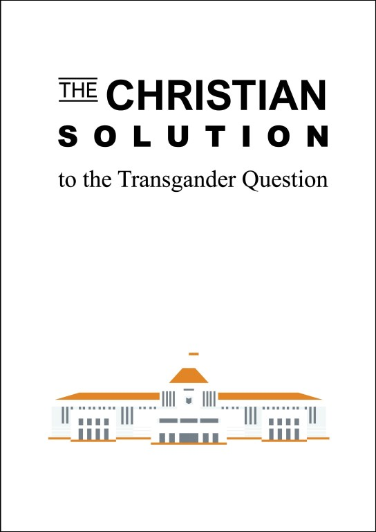

# Call to action
**Vickreman Harvey Chettiar** is an autistic Singaporean Tamil intersex transgender woman who has been incarcerated in Changi Prison Complex in a male prison environment for pre-trial remand since 6 April 2024. Harvey has been subject to disproportionate punishment, seen in both her period of remand and an excessive plea offer from the Prosecution of **9 years** in prison for her 14 charges.

What does this have to do with the safety of Singapore?

The once-U.S.-centric world order has given way to multipolarity and escalating contestation. In addition to the great powers such as the U.S., China, Russia, and India, leading middle (in both might and location) powers such as Saudi Arabia, Israel, and Iran, have also emerged and consolidated.

Singapore sits at the heart of the Indo-Pacific: at the mouth of the Strait of Malacca, a critical chokepoint for trade in the region. On top of that, Singapore's high population density and small size make it easily governable. This means that Singapore is highly scalable, and viewed as a viable country in the Indo-Pacific region for the powers to test out their respective expansionist blueprints, before going on to replicate their models throughout the region. Every single one of the great powers and middle powers is exercising their interests in Singapore, to varying degrees.

The Christian far-right of both Singapore and the US is interested in securing Singapore as a religio-political base to expand into the rest of Asia, whereas China is interested in Singapore as a tributary state for its politico-economic pan-nationalist agenda. All the powers are ultimately threatened by a potentially independent and self-sufficient Indo-Pacific, which is why even Afro-Asian solidarity, such as in the Bandung Conference of 1955, was seen as a threat by global imperialist countries in the 1950s and 1960s. This can be seen in the U.S.’ Free and Open Indo-Pacific (FOIP) concept, China’s Belt & Road Initiative (BRI), India’s Free, Open, Inclusive Indo-Pacific (FOIIP) policy, and even Indonesia’s ASEAN Outlook on the Indo-Pacific (AOIP) plan. 

The natural consequence of this inter-power rivalry is obviously the escalation of conditions fermenting in the potential outbreak of World War 3. To be clear, Singapore is not the sole prize: Territorial disputes in the South China Sea and in the so-called Middle East are also relevant to superpower rivalry. Singapore, however, would certainly be a rewarding catch.

The 2010s saw the rise of the Silicon Valley Big Tech and startup landscape, facilitated by a period of zero interest-rate policy. It was against this backdrop that in 2020, the National University of Singapore announced the merger the Faculty of Arts and Social Sciences (FASS) with the Faculty of Science (FoS) to form the College of Humanities and Sciences (CHS). This was followed in 2021 by the announcement of the mergers of the Faculty of Engineering (FoE) with the School of Design and Environment (SDE) to form the College of Design and Engineering (CDE), and Yale-NUS College (YNC) with the University Scholars Programme (USP) to form what is now NUS College (NUSC). In response, students launched the [**#NoMoreTopDown**](https://www.change.org/p/nus-president-prof-tan-eng-chye-nus-reverse-the-mergers-and-nomoretopdown?ref=victimsofmalice.com) petition. #NoMoreTopDown framed the mergers as indicative of a university administration which concentrates power and makes top-down decisions. The campaign also hit at the mergers as an exercise of power by the extractive classes to rig the labor market in their favor by boosting enrollment in their desired computing and engineering fields, while also force-fitting such topics into other majors, at the expense of the workers who would graduate from these merged institutions and experience reduced salaries and increased disposability and precarity. The campaign thus directly attacked the core of their economic interests. We can directly see [this education policy in play today](https://www.straitstimes.com/singapore/s-pore-universities-computing-enrolment-surges-amid-industry-changes-and-stiff-competition-for-jobs).

China's **Ministry of State Security (MSS)** believed Carissa to have been involved with coordinating #NoMoreTopDown behind the scenes, and assessed that she "might potentially rouse the citizens of Singapore against the Chinese trying to take over when the time comes, and be successful." They have been trying to neutralize Carissa ever since, but they deemed Harvey to have had and still have capabilities to protect Carissa. This is one of China's multiple interests in putting Harvey away behind bars.

Meanwhile, the Christian far-right is running **Operation High Tide**, an operation to criminalize transgender people, and eventually all LGBTQ+ people. Harvey, who has suffered much transphobic physical and sexual violence both in the course of Operation High Tide and outside of it, presents a problem to them as she can testify to her experiences and sow outrage against the agents and systems that inflicted such violence on her.

Singapore's state organs, such as the police, Attorney-General's Chambers, and even the Internal Security Department, have been made use of by agents of MSS and other parties for their purposes. Furthermore, notable individuals in these state organs, and even Cabinet ministers, use their positions to serve their varying allegiances and alignments to the Christian far-right or MSS, along with their own interests. One of the keys to maintaining and growing their power is Singapore's upcoming General Election, due to be called by November 2025. They have a common interest in keeping Harvey behind bars so that she cannot cause any trouble for them ahead of the election.

Harvey's persecution at the confluence of this power grab is but a precursor to what the powers will do to the queer and trans communities, followed by Singapore at large. "First they came…" [Just read the fucking poem.](https://www.hmd.org.uk/resource/first-they-came-by-pastor-martin-niemoller/)

The first step to stopping the Christofascist genocide of queer peoples, as well as foreign powers' attempts to take over Singapore for their own benefit, is to get Harvey out of prison, and keep her out of there. **Speak Harvey's truth to power.** We do not want another trans woman broken, smeared, scapegoated or dead. Enough is enough. We want safety for Harvey and justice for Harvey – before it's too late.

Help in any way that you can. Be creative. Be collaborative.

Solidarity with Singapore, Queer people everywhere, people all over the world battling fascism and imperialism. All power to all people.

# What is this site?
This site aims to synthesize and summarize available information online related to the persecution of **Vickreman Harvey Chettiar** and other marginalized victims by the Christian far-right, China's Ministry of State Security, and other parties, under **Operation High Tide** and other operations.

**CW for the site as a whole:** Rape, child sexual abuse, revenge porn, homophobia/transphobia, murder, stalking, religious extremism, Christofascism

# How to read this site
The content of this site is long, as the history of this situation is both long and dense. It is not necessary to understand all the details of the situation; you may engage with the contents of this site as it interests you.

The [call to action](#call-to-action) provides a high-level overview of the situation. The [next section](#further-background-to-the-situation) provides some background on its earlier developments. The sections after that explain Operations [High Tide](#operation-high-tide), [Providence](#operation-providence), [Qadar](#operation-qadar), and [Hercules](#operation-hercules). After that, you can peruse [Summary of key persons and events](#summary-of-key-persons-and-events) to fill in any gaps in your knowledge if you wish. It is in approximately chronological order, so content at the end of the section is the most recent.

This site ends with two in-depth commentaries on the socio-political and geopolitical aspects of Operation High Tide and Christofascism.

# Further background to the situation
Singapore's domestic intelligence agency, the **Internal Security Department (ISD)**, was established in 1948 as the Singapore Police Special Branch (it was renamed in 1966), when Singapore was still a British colony, and was later acquired by Singapore's incumbent political party, the **People's Action Party (PAP)**, after Singapore gained formal independence. Given global superpower rivalry – particularly but not exclusively between the U.S. and China – and Singapore being seen as an ideal strategic stronghold for its [three key characteristics](#call-to-action) and its majority Chinese population, the ISD has been infiltrated by foreign agents with loyalties to China, and likely other nations as well.

**Mercury Jamie Alice (Mercury)** is an ISD fixer, and a serial abuser and harasser in her own right. **Vickreman Harvey Chettiar (Harvey)** is an autistic Tamil woman who has suffered much alienation and systemic injustice in her life. She was originally solicited to be a fixer against opposition politician Kenneth Jeyaretnam in 2013, in the ISD's **Operation Providence**, but ultimately this was not successful.

Mercury and Harvey were friends from 2019 to 2021; the friendship ended when Harvey [failed to/refused to](https://twitter.com/Justice4Harvey/status/1675856323999825920) help Mercury with certain matters, including Mercury's [anthrax hoax](https://www.todayonline.com/singapore/youth-charged-false-anthrax-attack-bedok-1907586), and Mercury betrayed Harvey. Meanwhile, **Carissa Cheow (Carissa)** is a Permanent Resident (PR) of Singapore, who was initially seen as a candidate for ISD recruitment, until it became clear that she was politically divergent from them, and was consequently deemed a political threat. Harvey and Carissa met in 2019, which caused the ISD to worry, as the ISD had interfered in both their personal lives and was now worried that their collaboration would expose these interferences. This kickstarted the need for the ISD's **Operation Qadar**.

On 18 June 2022, an action called [**Brown Dot**](https://victimsofmalice.com/our-first-statement-overview-of-the-situation/#pink-dot-2022) included advocacy for Harvey. Carissa was part of this. At the ISD's encouragement, Mercury then started harassing, impersonating, stalking, sending death threats to and spreading revenge porn of the people at Brown Dot who had advocated for Harvey, using burner accounts that had been registered under Harvey's official National Registration Identity Card (NRIC) number in a case of [identity theft](https://drive.proton.me/urls/5Z4H17ZA1G) – so that this would ultimately trace back to Harvey and she would be pinned for all the crimes. The main objective of this was to discredit Harvey, and use Harvey's political and criminal elimination as grounds to deport Carissa from Singapore. The secondary objective of this was to create fractures, paranoia, betrayal and distrust in activist spaces in Singapore. The people involved in advocating for Harvey are loosely referred to by the ISD as "Hydra-22". They are considered necessary to be dealt with in order to crush Harvey and Carissa. The operation against Hydra-22 is known as the ISD's **Operation Hercules**.

The main victims of Mercury (and, by extension, the ISD) then began seeking legal recourse, including applying for protection orders. Mercury thus [started attending](https://ipfs.thirdwebcdn.com/ipfs/QmRLtnEtCHK8tUtVHw5hKiH5KNru3Ypg4f8JPJyo5Gi2Gv/) **Cornerstone Community Church** for assistance. Mercury claimed to be a _detransitioner_ who was being framed for all these crimes by her LGBTQ+ victims, and that her victims were persecuting her for detransitioning. From here, Mercury got pulled into the Christian far-right operation, [**Operation High Tide**](#operation-high-tide). The ISD is not responsible for Operation High Tide, but has prodded the Christian far-right in certain directions to its benefit.

The ISD and the Christian far-right have been attempting to silence or discredit the victim-witnesses to Mercury's crimes, some of whom are LGBTQ+, others of whom are not. An example of their fascist tactics includes psychologically destroying Harvey by getting her remanded for pre-trial detention in prison (which can last for [years](https://www.instagram.com/p/Csay1gvOXFB/)), where she would be placed in the male section, ["so that she will not be able to testify coherently and/or reliably in any criminal or quasi-civil Court case"](https://victimsofmalice.com/mandrake-werewolf-poison-ivy/). Another example includes [framing **Wong J-min (J-min)** for the murder of her own grandfather](https://victimsofmalice.com/lucien-wong-easter-surprise-murder/), whose death was actually claimed by Mercury as a [murder](https://victimsofmalice.com/mercury-claims-9th-murder-jia-mins-grandfather/). As a result, J-min is in the U.K. [seeking asylum](https://twitter.com/jminwong/status/1669702139885518852), due to [persecution](https://sittingonthetrain.substack.com/p/hard-launching-my-refugee-sob-story) by Christofascists and ISD fixers in Singapore.

The threats continue: **Lune Loh (Lune)**, a victim of Mercury who is studying in the U.K., also had to consider asylum, but there was a plot to frame her for child sexual grooming in the U.K., [also instigated by the Witherspoon Institute](https://victimsofmalice.com/operation-louve-garoul/), forcing her to return to Singapore.

Meanwhile, multiple quarters of the Singapore state, rather than investigating and prosecuting the perpetrators, seem to be covering up the situation to prevent reputational damage. Prime Minister Lee Hsien Loong assented to [Operation Ink Tiger](#operation-ink-tiger) to destroy evidence of Mercury's crimes, delegating away his authority over the Internal Security Department (ISD) to carry it out — just as ISD had framed Harvey a decade ago in [Operation Providence](#prelude-operation-providence) to coerce her into framing and silence a nosy opposition politician, for the purpose of covering up the state's mismanagement of the population's compulsory retirement funds.

Fascist targeting and persecution will not stop at Mercury's victims. It will not stop with trans people. It will not stop with LGBTQ+ people. It will not stop at Singapore. It will not stop at Florida, Mississippi, North Dakota, Tennessee, Montana, Iowa or Indiana. "First they came…" [Just read the fucking poem.](https://www.hmd.org.uk/resource/first-they-came-by-pastor-martin-niemoller/)

List of people of note:

1. **Hydra-22:** Carissa Cheow, Vickreman Harvey Chettiar, Joyce Ng, Wong J-min, Lune Loh, Tobias Keh, and other associates, such as Justice4Harvey, Safety4Harvey, Safety4HarveyUK, Safety4HarveyUS and Safety4HarveyAu
2. **Internal Security Department (ISD):** Operation Providence team, Operation Qadar team, Operation Hercules team, Mercury's handler Shawn
3. **Fixers:** Mercury Jamie Alice, Heather D Tan Zi Min, Elise He Jiasheng, Harvey's rapist Syafik
4. **Christian far-right Singaporeans involved in Operation High Tide:** Carol Loi (CanaVox, Focus on the Family Singapore), Lawrence & Nina Khong (Faith Community Baptist Church), Thio family, 3:16 Church, Cornerstone Community Church, Church of our Saviour
5. **Christian far-right Americans involved in Operation High Tide:** The Heritage Foundation, The Witherspoon Institute, CanaVox
6. **Corrupt public, civic or legal officeholders:** Tan Chuan-Jin, Indranee Thurai Rajah SC, Gan Kim Yong, Seah Kian Peng, Lucien Wong Yuen Kuai SC, Rujan S/O Nagarajan, Parvathi Menon, Ng Yong Kiat Francis, Kuah Boon Theng, Kessler Soh Boon Leng, Roger Seah Ming Hui (linked to China), Jonathan Au Yong Kok Kong (linked to China)
7. **China's Ministry of State Security assets:** Roger Seah Ming Hui & Jonathan Au Yong Kok Kong (via the secret society Wah Kee 华记, which operates in several countries)

# Operation High Tide
**Operation High Tide** is an attempt by several Christofascist, evangelical organizations based in the U.S. to influence public policy and legislation in Singapore, through their respective networks located in Singapore. It began in March 2020. Its aim is to criminalize people with, or suspected to have, Gender Dysphoria, and have them institutionalized. This parallels efforts in Ghana, Kenya, Nigeria and Uganda.

Operation High Tide is currently under the supervision of [The Heritage Foundation](https://www.heritage.org/), which is also responsible for [Project 2025](https://www.project2025.org/).

Before that, it was directly supported by these three organizations in the U.S.:
1. The Witherspoon Institute [[x](https://winst.org/)] [[x](https://www.influencewatch.org/non-profit/witherspoon-institute/)] [[x](https://www.dailyprincetonian.com/article/2023/05/princeton-opinion-james-madison-program-funding-ideology)] [[x](https://ipscell.com/2012/01/secrets-of-the-wingnut-witherspoon-gang/)] [[x](https://www.thepinknews.com/2020/06/03/lgb-alliance-gary-powell-center-bioethics-culture-alliance-defending-freedom-anti-lgbt/)]
2. CanaVox [[x](https://canavox.com/our-reading-groups/groups-near-me/)] [[x](https://winst.org/canavox/)] [[x](https://www.reddit.com/r/Christianity/comments/hrj54y/experience_with_canavox/?rdt=53990)] [[x](https://www.rightwingwatch.org/post/anti-lgbt-latina-mama-packs-a-lot-of-stereotypes-into-message-to-pete-buttigieg/)][[x](https://www.vice.com/en/article/3k8qmw/uncovering-the-christian-think-tanks-behind-the-bogus-studies-on-gay-parenting)]
3. Global Rainbow Crossers Alliance [[x](https://www.taipeitimes.com/News/feat/archives/2019/12/19/2003727797)] [[x](https://equal-eyes.org/database/2019/12/20/taipei-rainbow-crossing-conversion-therapy-by-another-name)]

The ultimate goal of Operation High Tide is "to turn society as a whole against [transgender persons] and other LGBTQs, and get these "perversions" criminally punishable". This parallels Christofascist efforts to push their anti-Queer agenda domestically (on a state and federal level), as they've tried to ideologically and materially institute Christian nationalism in the U.S.

Operation High Tide also parallels their attempts, or even successes, in various countries in Africa:

> Though Ghanaian evangelicals were the driving force behind the proposed legislation, the influence of the U.S. Christian right is evident – and Ghana is just one of many countries where conservative Christian activists, in particular evangelical groups, have sought to remake the world in line with their religious beliefs and political ideology. Indeed, evangelical groups have played an increasingly powerful role in world affairs since the 1970s, shaping U.S. foreign relations as well as laws and culture in countries around the world.
>
> —_Lauren Frances Turek (2022), ["U.S. Evangelicals Are a Foreign Policy Force to Be Reckoned With"](https://www.worldpoliticsreview.com/evangelicals-us-foreign-policy-religious-freedom/), World Politics Review_

In Singapore's context, Operation High Tide aims to:

1. have **healthcare policy** amended so that being transgender is classified as a mental illness, warranting institutionalization until one's mental illness of "transgenderism" is "cured".
2. have **legislation** altered so that "transgenderism" is criminalized, and "repeat offenders" can be sentenced to preventive detention.

Below is a recreation of the cover of a 28-page document written by top Christofascist leadership in Singapore, complete with font formatting and typo, titled "The Christian Solution to the Transgander Question".

This is an existential threat to trans people in Singapore and worldwide, individually and collectively. It threatens the very survival of trans people. As with any form of fascism, the [genocide might begin with trans people](https://safetyforsingapore.com/lemkininstitute.com/statements-new-page/statement-on-the-genocidal-nature-of-the-gender-critical-movement%E2%80%99s-ideology-and-practice) but it certainly won't stop there.

Operation High Tide involves the following Christian churches/organizations in Singapore:

1. Focus on the Family Singapore
2. Cornerstone Community Church
3. Church of Our Saviour
4. 3:16 Church
5. Liberty League
6. Faith Community Baptist Church

Hoping to quicken/enhance Operation High Tide, individuals, and sometimes leadership, in the associated Christian churches/organizations in Singapore have found strategic alignment with an individual by the name of **Mercury Jamie Alice**, who is politically far-right but not _Christian_ far-right per se.

Prior to linking up with Operation High Tide, Mercury was already, and still is, facing her own criminal investigations and charges – due to serial rape, harassment, threats, stalking and surveillance, and having committed an [anthrax hoax](https://www.todayonline.com/singapore/youth-charged-false-anthrax-attack-bedok-1907586) in 2021. Mercury's criminal case is major in Singapore's context as it deliberately exploits policy and legal gaps in the system on a scale and with a specificity that no person or institution has witnessed before. For decades, the Singaporean state has marketed itself domestically and to the international arena as a near-utopian system of governance – politically, economically, socially and culturally.

But how big is the gap between marketing and reality? There are vulnerabilities in Singapore, related to and laid bare by Mercury:

1. Singapore seems to be unprepared for a far-right actor as malicious and relentless as Mercury, and who _does not want to get caught_ (as opposed to far-right actors who are open and vocal about their beliefs and behaviors).
2. One of Mercury's main crimes is the mass-scale circulation of revenge porn of one of her main victims, **Wong J-min**. The police themselves have described the reach of these videos as "landmark". However, Singapore does not seem to be properly equipped to efficiently and effectively deal with newer technology-related criminal methods and cybercrimes, including deliberate evasion and concealment, which Mercury actively weaponizes.
3. Singapore's police protocol/bureaucracy appears unable to be efficient enough to keep up with Mercury, in light of the above two points. This worsens with the involvement of corrupt state actors from or aligned with the Christian far-right, who are well-resourced and positioned in places of political and legal authority.

Desperate to escape the consequences of her own persistent violations, Mercury got in touch with elements of the Christian far-right. She constructed a false narrative claiming to be a detransitioner being framed, cancelled and punished by her own victims, whom she'd deliberately mischaracterized as "trans extremists" obsessed with gender ideology. This way, Mercury managed to entangle her already-complicated personal criminal case with the broader covert Operation High Tide.

Operation High Tide:

* predates Mercury's involvement
* is only working with Mercury insofar as their interests/goals happen to align
* will discard (or already has discarded) individual actors, including but not limited to Mercury, the moment their interests/goals no longer align or they become a liability
* is a Christofascist conquest that will eventually spare no one and needs to be dealt with A.S.A.P., as fascism fucks over the marginalized _and_ the masses
* risks escalating war as various types of fascist regimes compete with one another for dominance
* if successful, will be considered a strategic victory (ideologically and politically) to Christofascists in the U.S., emboldening them as they continue to tighten their grip over Republican states, fight to flip Democratic states, and win at a federal level

# Operation Providence
**Operation Providence** was a failed operation in 2013 by Singapore's domestic intelligence agency, the Internal Security Department (ISD), to draw attention away from bottom line economic concerns related to the security of citizens' retirement funds, known as the Central Provident Fund (CPF). Vickreman Harvey Chettiar had been selected as a fixer for Operation Providence: The ISD attempted to coerce and intimidate her into making false claims about economist Kenneth Jeyaretnam having links to the Liberation Tigers of Tamil Eelam (LTTE), to stop him from posing crucial questions about whether citizens' retirement funds were transparently and accurately stored in the CPF, or if they'd been mismanaged and invested elsewhere. More details can be found [here](#prelude-operation-providence).

# Operation Qadar
**Operation Qadar** is an operation [originally targeting](https://victimsofmalice.com/carissa-real-target-of-isd-and-mss) [Carissa](#carissa) to stem her potential to become a political threat. When [Harvey](#harvey) was seen to be capable of boosting and protecting Carissa, Operation Qadar was pivoted to target Harvey instead. Mercury has been heavily involved in Operation Qadar, and led to believe that it was for their mutual benefit by way of promises of legal protection and logistical assistance. In reality, Mercury has been used as a pawn by the ISD. Virtually all of Mercury’s crimes from June 2022 onwards that were not in service of the Christian far-right’s Operation High Tide have been advised or enabled by the ISD’s [Operation Qadar](https://victimsofmalice.com/4d-chess-masterminds/#operation-qadar), including:
* Leaking J-min's sex tapes and doxxing her on Transformative Justice Collective chatgroups, with said chatgroup links provided by ISD
* Impersonating multiple people with Telegram burner accounts to get Harvey pinned for the impersonation

# Operation Hercules
**Operation Hercules** is an ongoing operation by the ISD to target [Hydra-22](https://victimsofmalice.com/statevsubhas/#reckoning) – a codename assigned by the ISD to Carissa Cheow, Joyce Ng, Wong J-min, Lune Loh, and other associates, such as Justice4Harvey and Safety4Harvey. It is a separate ISD section from the Operation Qadar team, but information is exchanged between the two squads, and coordination sometimes occurs. Operation Hercules [started](https://victimsofmalice.com/4d-chess-masterminds/#operation-hercules) "because of the emergence of Hydra-22 at [**Brown Dot**](https://victimsofmalice.com/our-first-statement-overview-of-the-situation/#pink-dot-2022) on 18 June 2022".

# Summary of key persons and events
This section provides a generally-sequential outline of the people and organizations involved in the situation.

## Carissa
* [**Carissa Cheow**](https://victimsofmalice.com/carissa-real-target-of-isd-and-mss) is a Malaysian Citizen and Singapore Permanent Resident (PR), born and raised in Singapore her whole life.
* Carissa was a fixer candidate for [Operation Providence](#prelude-operation-providence). The Providence team has thus been monitoring her since 2012 to ensure that she does not become a problem.
* In 2019, Carissa co-founded [**SafeNUS**](https://safenusexco.wixsite.com/website). The ISD became concerned about her organizing abilities, and conceptualized [Operation Qadar](#operation-qadar).
* In 2020, Carissa ran in the National University of Singapore Graduate Students' Society election, and was elected Vice-President (External).
* In 2021, the [**#NoMoreTopDown**](https://www.change.org/p/nus-president-prof-tan-eng-chye-nus-reverse-the-mergers-and-nomoretopdown) campaign amassed over 13,000 signatures in just 5 days, and Carissa was thought by MSS to have coordinated the campaign behind the scenes.
  * The MSS thus viewed Carissa as a threat to their foreign interference operations in Singapore for similar reasons to the ISD, and began targeting her.
* ISD/MSS have tried various means to neutralize or eliminate Carissa, including overstating her school fees and meddling with her immigration matters.
* Overall, Carissa's history and position in various spaces have led to both the ISD and MSS evaluating her as a high-risk threat to their disparate interests. Carissa is the real target of Operation Qadar, while Harvey is the current main target whom ISD and MSS have determined must be eliminated first before they can get to Carissa.

## Harvey
* **Vickreman Harvey Chettiar** is an autistic Tamil trans woman from and in Singapore.
* Harvey has been [alienated since childhood](https://singaporedissident.blogspot.com/2014/01/singaporean-young-man-of-indian-descent.html); she changed primary schools 6 times as she was bullied for being "different", eventually dropping out of the school system to take national exams privately.
* In 2013, Harvey was chosen by the ISD to frame up Kenneth Jeyaretnam as part of [Operation Providence](#prelude-operation-providence).
* In 2013 and 2014, Harvey was [twice investigated and charged for a bomb hoax, and then acquitted](https://www.instagram.com/p/CsgOMOhLLSi/). The first bomb hoax was a [fix-up by the Internal Security Department](https://textdoc.co/FGh6VD3R4ZkBrOXQ) under Operation Providence as an attempt to secure her cooperation.
* Each time she was charged for each of the bomb hoaxes above, she was remanded to a remand ward at the Institute of Mental Health (IMH) to be evaluated for fitness to plead.
* During her second stay in IMH, Harvey [suffered a rape in the IMH ward](https://www.instagram.com/p/Cr9yFVgJiN6/?img_index=3) on 24 February 2014 by Syafik, her assailant, followed by continued sexual assault by Syafik until 2 March 2014.
* Harvey filed a police report about the rape in November 2014. Police [responded](https://www.instagram.com/p/CLVokbcn22z/) with ["no further action"](https://www.instagram.com/p/CsDo0d6ruZm/?img_index=4) in March 2016.
* As a result, Harvey [filed a lawsuit against IMH](https://www.instagram.com/p/CsDo92TrlOz/?img_index=2) on 12 December 2016. It was struck out in 2021.
* Safety4HarveyUS has published [a summary](https://www.instagram.com/p/CuaFYUPPCoK) of Harvey's background and the four criminal charges she currently faces.
* After gaining a physical social existence in 2017, Harvey was seen to have rapidly expanded her social circles and become an extremely capable structurer in Mensa Singapore in the span of 1.5 years.

## Carissa and Harvey cross paths
* Carissa and Harvey became acquainted with each other in June 2019 at an activist event. This caused the Internal Security Department (ISD) alarm due to the meeting of two people who have been subject to ISD interference in their respective personal lives for political interests, as well as the potential of Harvey applying her organizational skills in SafeNUS.
* ISD and the Singapore police believed that Harvey had raised $30,000 out of the $48,000 raised for Carissa's school fees in the [#HelpCariSleep](https://gogetfunding.com/help-cari-sleep/) fundraiser. Harvey thus became a threat in ISD's eyes, and Operation Qadar was pivoted to target her.
* MSS perceived Harvey as having leveraged connections to stop Carissa's Permanent Residence (PR) status from being revoked. This led MSS to decide that Harvey would have to be eliminated first, before Carissa can be dealt with.

## Mercury
* **Mercury Jamie Alice** is a far-right individual facing criminal investigations and charges in Singapore. [[x](https://www.todayonline.com/singapore/youth-charged-false-anthrax-attack-bedok-1907586)] [[x](http://tinyurl.com/AGC-letter-on-MJA)] [[x](https://ipfs.thirdwebcdn.com/ipfs/QmY1Y3mjTKnjKi3G1DaL2Ge1sfjxcKXxVYzNPmXoPeiMaS/)] [[x](https://victimsofmalice.com/our-first-statement-overview-of-the-situation/)] [[x](https://victimsofmalice.com/mercurys-august-2021-claims-against-the-singapore-police-force-spf/)] [[x](https://victimsofmalice.com/hate-mail-1/)] [[x](https://victimsofmalice.com/vom-at-risk-mercury-attempts-to-remove-our-blog-and-social-media/)] [[x](https://victimsofmalice.com/mercury-claims-legal-abuse-and-further-threatens-carissa-with-bodily-harm/)] [[x](https://victimsofmalice.com/mercury-claims-8-murders-threatens-a-9th-kill/)] [[x](https://victimsofmalice.com/cybercrimes-part1/)]
* For the most part, Mercury has been supported by a small, loose and unofficial group of far-right (including alt-right) collaborators and sympathizers, primarily her girlfriend **Heather D Tan Zi Min**. [[x](https://www.instagram.com/p/CuJsMAirrI-/?img_index=7)] [[x](https://victimsofmalice.com/our-first-statement-overview-of-the-situation/#ongoing-stalking-of-and-death-threats-against-carissa-s-family)] [[x](https://victimsofmalice.com/mercury-claims-9th-murder-jia-mins-grandfather/)] [[x](https://www.instagram.com/p/CaNL6q7hcc3/?img_index=1)] [[x](https://www.instagram.com/p/CaNP2Vnha7Z/)]
* In February 2019, Mercury had [raped her 8-year-old stepsister Beatrice](https://drive.proton.me/urls/MCWMJTJFB4#qMgGq1UUl1Q3) in their family home, prompting her mother and stepfather to [kick her out in March 2019](https://www.instagram.com/p/CT6Ch-tPN9v/). She had concealed this information from Harvey, who was supporting Mercury [out of genuine care and solidarity](https://www.instagram.com/p/CtaicI4LHoH/) from 2019 to 2021.
* Mercury has worked with multiple different actors for criminal purposes, based on strategic alignment (e.g. mutual interest to sabotage/discredit Harvey, even if for different reasons) or in her perceived lack of alternatives (e.g. if she's in need of money or she wants leniency).
* These prior collaborations either predate Mercury's [August 2021 anthrax hoax](https://www.todayonline.com/singapore/youth-charged-false-anthrax-attack-bedok) or her escalatory behavior in relation to Victims Of Malice in [late June 2022 onwards](https://victimsofmalice.com/our-first-statement-overview-of-the-situation/#impersonation), and are separate from her entanglements with the Christian far-right.
* These prior collaborations include:
  * fixing up Singaporean lawyer/politician **Charles Yeo Yao Hui** (who's an asylum-seeker in the U.K. due to political persecution) [under the orders of **Attorney-General Lucien Wong**](https://victimsofmalice.com/charles-yeo/), with [**Joseph Chen**](https://www.instagram.com/p/CgwJbb7ABcw/) and [**Saha Ranjit Chandra**](https://www.straitstimes.com/singapore/courts-crime/man-charged-with-using-fugitive-lawyer-s-name-to-dupe-2-insurance-firms-of-nearly-77k) also involved as fixers, on "the understanding that such service to the State keeps one in the good books, and might result in future favours";
  * helping the **Institute of Mental Health (IMH)** [spy on Harvey](https://www.instagram.com/p/CuHNA0yxOKy/?img_index=5) from January 2021 to March 2021 to gather intelligence in exchange for $750 each month;
  * helping the **National Healthcare Group's (NHG)** law firm **Legal Clinic LLC** ensure the success of a [forged court correspondence letter](https://www.instagram.com/stories/highlights/18240403798122895/) in March 2021 [in exchange for $3,000](https://www.instagram.com/p/CuHNA0yxOKy/?img_index=7), with the [two goals](https://www.instagram.com/p/CtjIVlYLiyf/?img_index=10) of making it difficult for Harvey to ever re-open her lawsuit against IMH for her 2014 rape, and isolating Harvey from possible support networks and resources; and
  * [working with Harvey's rapist **Syafik**](https://victimsofmalice.com/who-the-hell-are-mohd-nordin-and-syafik-iskandar/) from November 2021 to June 2022, including an attempt to poison Harvey in December 2021, which [failed](https://victimsofmalice.com/our-first-statement-overview-of-the-situation/#claim-to-harvey-s-grandfather-s-murder) and ultimately resulted in the [death of Harvey's grandfather](https://www.instagram.com/p/CZbcR5nFdXz/) instead.

## Harvey and Mercury cross paths
* Harvey and Mercury became acquainted with each other in February 2019.
* Mercury told Harvey that she had been kicked out of her family home for being trans. Harvey thus [supported Mercury](https://www.instagram.com/p/CtaicI4LHoH/?img_index=4) emotionally, financially, logistically and legally until August 2021. This included helping Mercury find rooms to rent, and paying out over $30,000 for Mercury's expenses.
* Harvey also helped Mercury file for child maintenance claims from the latter's mother. However, [during the trial for the claims on 5 November 2020](https://www.instagram.com/p/CtaicI4LHoH/?img_index=9), Mercury passed Harvey her bag, which, unbeknownst to Harvey, contained a knife. Harvey was thus stopped by security, and due to delays, ended up missing the trial. This resulted in Mercury's child maintenance claims being struck out without being heard. This caused Mercury to become resentful towards Harvey. Meanwhile, Harvey took the fall for the knife when interviewed by the police.
* On 9 August 2021, [Mercury commited an anthrax hoax](https://www.todayonline.com/singapore/youth-charged-false-anthrax-attack-bedok-1907586). The goal was to frame her ex-girlfriend for the hoax by filing an online police report in her ex-girlfriend's name, while also [accusing her ex-girlfriend's ex-boyfriend](https://victimsofmalice.com/our-first-statement-overview-of-the-situation/#mercury-s-anthrax-hoax) of planning to release anthrax spores. The goal was to have both of them interrogated by the police.
* Before this, Mercury had sought Harvey's help with filing the report to ensure untraceability. Harvey refused but Mercury went ahead anyway. The false report was traced back to her and she was arrested within 2 hours – a backfiring that Mercury had not accounted for.
* Mercury later filed a police report on 13 August 2021 containing false testimony against Harvey, [claiming that Harvey had lied about her 2014 rape and PTSD](https://www.instagram.com/p/CSjAl21FQHc/). This explicit betrayal would cause Harvey to cut ties with Mercury in late August 2021. Mercury then retracted her 13 August 2021 police report by filing a [_new_ police report](https://www.instagram.com/p/CTXABU9FiiN/) on 2 September 2021 to make clear that her previous police report contained false testimony.
* You can read more about the history between Harvey and Mercury in the [Harvey X Mercury series](https://www.instagram.com/p/CtaicI4LHoH) on Justice4Harvey.

## Brown Dot, more victims pulled in
* [**Brown Dot**](https://sittingonthetrain.substack.com/i/130766082/brown-dot-d-day-and-the-legend-of-the-ghillie-suit) was an independent action conducted at Pink Dot 2022. The plan was to hold up brown cloth backed by placards to put a brown dot in the sea of pink during the light up.
* The purpose of Brown Dot was to call out Pink Dot's unsatisfactory representation of race issues.
* Brown Dot also incorporated advocacy for Harvey's story as a brown (Tamil) queer and trans person and the injustices she faced with IMH.
* Mercury was at Pink Dot witnessing Brown Dot. Mercury started contacting people who were at Brown Dot, initially to ask them to advocate for her instead, but later devolved to severe harassment.
* Brown Dot became the starting point of the ISD's **Operation Hercules**, though the membership of ISD's "Hydra-22" classification is not exactly the same as the participants of Brown Dot.

### Mercury's harassment of victims drawn from Brown Dot
Mercury's [long list of violences](https://victimsofmalice.com/our-first-statement-overview-of-the-situation/#pink-dot-2022) include the following (non-exhaustive):
* Mercury's modus operandi is to impersonate people using burner Telegram accounts. With those accounts, she proceeds to engage in harassment. In one case, she was able to obtain **Carissa Cheow**'s address by impersonating **Lune Loh** and Carissa.
* During a previous sexual encounter with **Wong J-min** in 2020, Mercury had date-raped J-min by drugging her with gamma hydroxybutyrate (GHB). Mercury had also recorded footage of this sexual encounter without J-min's knowledge. On 21 July 2022, Mercury leaked said sex tape, along with J-min's full name and residential address, to multiple WhatsApp and Telegram groups. The recipient count is estimated to be in the hundreds of thousands.
* Claimed the death of Harvey's grandmother on 8 September 2022 as a murder by poisoning, and included details of her grandmother's hospital ward and the unsecured back path she took to secretly access her grandmother.
* Stalking Carissa and her family, the latter of which Mercury said was carried out by her girlfriend Heather.
  * When Mercury got Carissa's family's building address, she texted it to Carissa to cause Carissa to call the police. Using a surveillance camera set up by a collaborator, Mercury could see which apartment unit the police went to and accurately determined Carrisa's family's full address.
* Rape and/or death threats against multiple people including J-min, Harvey, Carissa, Carissa's family, and more.

## Mercury meets the Christian far-right
* At some point in late 2022, Mercury approached Cornerstone Community Church, claiming to be a detransitioner who is being framed for offences by her LGBTQ+ victims in an attempt to persecute her for detransitioning. This allegation against the victims and more can be seen in screenshots of **Carissa Cheow**'s letter to the Attorney-General's Chambers in [this post](https://victimsofmalice.com/lucien-wong-easter-surprise-murder/).
* Cornerstone Community Church began supporting Mercury, including providing funds for her subsistence.
* Mercury thus got entangled in [**Operation High Tide**](#operation-high-tide). This is also how the victims eventually came to learn of it.

## Lucien Wong
* **Lucien Wong Yuen Kuai SC** is the Attorney-General of Singapore. Before taking this position, he was the personal lawyer of Prime Minister Lee Hsien Loong.
* The [Attorney-General](https://www.agc.gov.sg/about-us/overview) is the legal advisor to the Government of Singapore, and also the Public Prosecutor.
* Lucien Wong is [linked to the Christian far-right](https://victimsofmalice.com/lucien-wong-easter-surprise-murder/) via his son Paul Wong, a lawyer-turned-pastor involved in churches/groups connected to CanaVox.
* Since April 2023, he been utilising his position of Attorney-General for his involvement in operations to silence the victims.

### Lucien Wong's victim silencing
* [During a work trip to Washington, D.C.](https://victimsofmalice.com/lucien-wong/), he asked U.S. Attorney General Merrick B. Garland to unmask the Victims Of Malice site by exercising powers under the USA PATRIOT Act.
* On the same trip above, he met with the U.S. Justice Department to request for the FBI to classify Victims Of Malice as an international terrorist organization, in order to obtain InterPol Red Notices.
* Hindered police involvement in triggering an autopsy of J-min's grandfather by [giving instructions to police not to attend to certain individuals, including many of Mercury's victims](https://victimsofmalice.com/lucien-wong-easter-surprise-murder/), and [ensuring the death case investigating officer was on field duty and uncontactable](https://victimsofmalice.com/mandrake-werewolf-poison-ivy/) until after the body was cremated.
* Led Operations Mandrake, Poison Ivy, and Werewolf, along side Carol Loi. See [Victim suppression operations](#Victim-suppression-operations).
* [Gave instructions to local media](https://victimsofmalice.com/operation-pillory/) that "any news coverage related to Harvey" is be checked and screened "before publishing", and that news relating to "any protests for Harvey" are not to be published.
* Helped iterate through [multiple versions](https://victimsofmalice.com/operation-pillory-versions-2-3-4/) of [Operation Pillory](#Operation-Pillory) by investigating and advising on the viability of different sexual crimes for which to frame Harvey.

## Hydra-22 suppression operations
Since April 2023, the victims have been subject to a continuous slew of operations by the Christian far-right to detain, discredit, and otherwise make them unable to testify against Mercury and the Christian far-right. The following illustrative diagram is taken from Carissa's [100 page letter to the President of Singapore and the Attorney-General's Chambers](https://victimsofmalice.com/3rd-letter-3-bundles-release/).

You can read more about these operations at the [Operations](/operations) page.

## #NoToMaleRemand protest
* On 31 March 2024, which is also Transgender Day of Visibility, Lune Loh carried out a [protest](https://www.instagram.com/p/C5P69xNRwd7) outside the Attorney-General's Chambers and near the State Courts.
* The protest sought to draw attention to the trauma and suffering that trans women face in a male prison.
* Lune's [press statement](https://bit.ly/notomaleremand) also highlighted the sexual assault Harvey had experienced at the hands of male security officers while being taken into custody at the State Courts Tower on 5 May 2023.

## Harvey's current incarceration
* Harvey had trial dates scheduled for 5-7 March 2024, but she could not attend them due to loss of consciousness and subsequent hospitalization. This led to the prosecution filing an Application for Revocation of Bail, leading to a series of Bail Revocation Hearings.
* On 22 March 2024, Harvey experienced a wave of panic attacks which caused her to depart late for her second Bail Revocation Hearing. The Court revoked her bail and issued a Warrant of Arrest against her. Harvey made an attempt to voluntarily surrender herself to the Court, but experienced another wave of flashbacks and was eventually sent to hospital.
* She received one Abscondment charge for each of the above two absences.
* Harvey was arrested at home on 5 April 2024, and then remanded in a male Correctional Unit in Changi Prison for pre-trial detention on 6 April 2024
* She has suffered great gender dysphoria and sexual suffering, as well as physical infirmities and irreversible damage. You can read about them in [this article](https://www.worldwithoutprisons.org/2024/08/09/vickreman-harvey-chettiar-a-singaporean-transgender-womans-experience-in-prison/).

# Commentary: U.S. Evangelical and Fundamentalist Christianity in Singapore?

Domestically, the 1970s in America saw Christain evangelicalism on the rise, as it began to permeate the public sphere and merge with nationalism. To be a good American patriot was to be obediently and faithfully Christian, as their moral values were, in a rhetorical maneuver, conflated with each other. 1976 was dubbed the "Year of the Evangelicals" by George Gallup and _Newsweek_ magazine.

> From the later 20th century, a particular theological doctrine has arisen within North American Evangelical circles and has expanded globally. Termed dominion theology (or dominionism), it encourages Christians to take control of the institutions or pillars of society so as to shape it according to a particular Christian vision. According to the "Seven Mountains Mandate", these pillars are government, business, education, religion, family, entertainment, and media.
>
> —_Paul Hedges and Luca Farrow (2022), ["Christian Far-Right Extremism: Theology and Typology"](https://www.rsis.edu.sg/rsis-publication/rsis/christian-far-right-extremism-theology-and-typology/), RSIS Commentary_

The spread of **[dominion theology](https://www.psa91.com/dominion01.htm)**, including the [application of the **Seven Mountains Mandate**](https://saltandlight.sg/news/make-a-difference-shape-your-marketplaces-culture/) (which some Christians have already [rejected](https://ethosinstitute.sg/seven-mountains-mandate/) as a theological distortion), found its way onto the shores of Singapore. The early 1970s in Singapore marked the beginning of the [**1972 Dunearn Revival**, in which "Philip Lee was filled with the Holy Spirit"](https://safetyforsingapore.com/(https://wrpf.org.sg/the-dunearn-revival/)). Momentum continued and evangelicalism proliferated:

> "If there's a word I would use, it would be 'growth'," said Rev Chee.
>
> "The number of churches, new church plants also grew — both independent as well as Anglican church extensions."
>
> The rise of the mega churches was linked to the revival too, he noted.
>
> For instance, pastors such as Yang Tuck Yoong (Cornerstone Community Church) were touched by the Spirit during this period and subsequently started their own churches.
>
> "Because of the revival, there were many people who were called into pastoring or full-time Christian vocations, as well as mission work," he said.
>
> In fact, Rev Chee himself gave his life to God when the revival was in full swing.
>
> Parachurch ministries also felt the impact.
>
> "Operation Mobilisation, Youth With A Mission, Campus Crusade for Christ — they all expanded during that period. Fantastic growth," he remarked.
>
> —_Thirst Singapore (2022), [""It changed the face of Christianity in Singapore": How the 1972 Revival transformed our nation"](https://thirst.sg/it-changed-the-face-of-christianity-in-singapore-how-the-1972-revival-transformed-our-nation/)_

In 1978, **[Billy Graham](https://www.britannica.com/biography/Billy-Graham)** – a highly influential American evangelical, known for embarking on over 400 crusades across the world in 185 countries/territories in 6 continent, ultimately reaching over 210 million people in estimates – ["prophesied that Singapore is called to be the Antioch of Asia"](https://frontierworks.org/sermons/singapore-the-antioch-of-asia/):

> [The Singapore Billy Graham Crusade] drew a record 337,000 over five days to the National Stadium in December 1978.
>
> Guests could hear the message in six different languages because volunteers distributed more than 8,000 sets of headphones designed for this purpose.
>
> At the conclusion of the Crusade, more than 19,600 people surrendered their lives to Jesus Christ, among them many of our country's present pastors and church leaders.
>
> —_Joey Lam (2018), ["Singapore Billy Graham Crusade 1978: A picture of supernatural unity"](https://saltandlight.sg/leadership/singapore-billy-graham-crusade-1978-a-picture-of-supernatural-unity/), Salt & Light_

To Christian evangelicals, this idea of Singapore being an Antioch nation is a divine calling and thus religious responsibility:

> Every church is called to be an Antioch church. I believe God desires Antioch cities and nations. I don't believe it's just Singapore that's supposed to be an Antioch.
>
> _But I believe that Singapore is supposed to be an Antioch of Antiochs._
>
> We are called to challenge other cities and nations to be Antiochs. But to be able to do that, we have to be doing something above and beyond what is happening anywhere. And I believe that is what God is calling us to: To go to nations and plant churches. To suffer for the Lord. To mentor churches to be Antiochs.
>
> To plant churches, that will plant churches, that will plant churches.
>
> —_Apostolic Overseer Rick Seaward (2018), ["Singapore, an Antioch of Antiochs"](https://saltandlight.sg/news/singapore-an-antioch-of-antiochs/), Salt & Light_

**Mac Pier**, who ["helped to birth the Concerts of Prayer Movement in 1988 in New York City"](https://lausanne.org/leader/mac-pier), is reported to have taken interest in Singapore as an important global city with influence in Asia and beyond, in as early as 2018. It appears that Christian evangelicals from the U.S. have deemed Singapore a strategic geo-political location to achieve religio-political goals:

> [Mac Pier] believed that the "Antioch of Asia" was well-positioned to facilitate the spreading of the Gospel, as well as to unite churches and develop young leaders in cities throughout the region – exactly what Movement Day was all about.
>
> [Rev Jonathan Wong's] "original sensing was that Singapore already had a lot of strong unity movements and networks and did not need another 'thing'." He was thinking of local entities like the National Council of Churches, the Alliance of Pentecostal and Charismatic Churches, Love Singapore and Festival of Praise, to name a few.
>
> Nonetheless, "whilst the idea did not resonate initially, there was a gentle prompting from the Holy Spirit to continue to track with Mac on this", said the Church of the Good Shepherd pastor.
>
> That "track" was extended when [veteran banker Timothy Wong], while attending a gathering for Movement Day at the Museum of the Bible in Washington DC, came across a prayer booklet for Indian cities.
>
> He said: "It dawned on me that whilst Singapore may not need a Movement Day, the rest of Asia needs one, and that Singapore can play a role in being a catalyst for this."
>
> […] The lead-up Movement Day Singapore UnConference was held on May 4 (Festival of Pentecost), and MDAC was slated for October 6 and 7 – the week before the Feast of Tabernacles, "which represents the ingathering of the final harvest".
>
> "There was a strong sense that the hand of the Lord was on all this."
>
> Furthermore, the meeting venues were both churches that were used mightily by God in the early days of the charismatic renewal of the 1970s. "They are also located prophetically at the head waters of the Singapore River.
>
> "Hence there was a strong sense of God's providence on this," said Timothy.
>
> —_Emilyn Tan (2022), ["Singapore Church hosts Movement Day Asia Cities for the first time"](https://saltandlight.sg/news/singapore-church-hosts-movement-day-asia-cities-for-the-first-time/), Salt & Light_

There are vulnerabilities in Singapore, related to the Christian landscape in Singapore:

1. Singapore's own **National Council of Churches** ["represents more than 250 churches of diverse Christian traditions and denominations"](https://www.straitstimes.com/singapore/church-councils-position-on-homosexuality-has-not-changed), and has used typical homophobic/transphobic religious right-wing dog whistles, [such as](https://nccs.org.sg/wp-content/uploads/2022/08/NCCS-EngChi-Stmt-on-s377A-20220823.pdf): framing "marriage as a heterosexual union and the family consisting of heterosexual parents as the basic unit of society"; framing Christian individuals who ought to be opposed to "the celebration of LGBTQ+ culture" as potentially at risk of being pressured "to support or participate in the LGBTQ+ activism, or risk facing "reverse discrimination""; and framing "same-sex sexual acts as contrary to God's order", and thus their need to "seek the Government's assurance that the religious freedom of churches will be protected as [they] continue to teach against same-sex sexual acts and highlight such acts, along with other sexual acts like adultery, fornication, or premarital sex, as sins that go against the clear teaching of the Bible".
2. The **People's Action Party** presently ruling the Singapore government [appears to be aware that the Christian far-right is a threat to the country](https://www.pmo.gov.sg/Newsroom/DPM-Lawrence-Wong-at-the-Religious-Rehabilitation-Groups-18th-Annual-Retreat-June-2023) for domestic and foreign policy reasons, but do not seem to be confronting them head-on. This reminds of the [strategy of appeasement](https://encyclopedia.ushmm.org/content/en/article/neville-chamberlain) employed by the British government, headed by Neville Chamberlain, in dealing with Adolf Hitler in the 1930s – and its failure to prevent World War II.
3. Christian diversity in Singapore appears limited or stagnant, with [Free Community Church](https://www.vice.com/en/article/xgz4gz/free-community-church-singapore-lgbtq-christianity-religion) being the only Queer-affirming church in the entire country. It appears that any remotely progressive variation of Christianity was snubbed out before it could ever take spark: In 1987, the People's Action Party heading the Singaporean government detained 16 people under the codename **[Operation Spectrum](https://eresources.nlb.gov.sg/infopedia/articles/SIP_1578_2009-10-31.html)**; these included "church organisations that it believed were used to further the Marxist cause", such as "the Justice and Peace Commission, of which [Vincent Cheng Kim Chuan, a full-time church volunteer who was one of the 16 detained] was the executive secretary, the Student Christian Movement of Singapore, the Young Christian Workers Movement and the Catholic Welfare Centre, which assisted foreign workers and maids working in Singapore." Given the paranoid extinguishing of religious leadership that is even slightly left-leaning or progressive, tendencies that are skewed to the right-wing appear to be void of a counterbalance to keep things in check within Singapore's Christian landscape.

# Commentary: Singapore government needs to take the influence of U.S. right-wing movements seriously and urgently
Harvey's own trial for her own criminal proceedings are speeding ahead, as the state/AGC wants the consequent appeal to conclude by the end of 2023. As a non-operative trans woman, upon her prison sentence, Harvey will be put in a male ward – leading to terminally fatal consequences. Firstly, Harvey will be forced to de-transition for years longer than the sentence, including being forcibly shaved bald. Secondly, Harvey will experience gender violence as she will be strip-searched by male prison officers. Thirdly, Harvey will also be placed in a male cell, where she will be forced to shower, defecate and urinate in front of up to 3–7 other male prisoners as well as male prison officers.

All this will not only be sexually humiliating and re-traumatizing for Harvey (particularly, but not exclusively, given her 2014 rape at IMH), but also puts her at severe risk of further sexual assault. Harvey will psychologically not survive. Trans suicide after incarceration is not an unusual phenomenon. Harvey's prosecution (and eventual death) means that Operation High Tide will succeed, as Harvey will no longer be alive to give testimony or defence against Mercury's crimes or "trans conspiracy" accusations. Harvey's immediate supporters in Singapore will be at high risk of prosecution and will be made scapegoats as LGBTQ+ "extremists". This narrative will in turn play right into the Christian far-right's rhetorical playbook.

We have seen the impact that far-right movements in various states in the U.S. have had and are having on Queer people, oppressed racial groups, (im)migrants, the disabled, and other vulnerable or subjugated communities. Beyond this, in various countries and historically, we have seen how far-right movements have given way to the breakdown or co-optation of national institutions, legal and bureaucratic processes, and public trust – alongside disrupting economic stability, growth and development. Golden Ages and financial prosperity under fascist regimes have been short-lived and unstable in the long-term, even for the ruling elites themselves.

We are entering into a time period of global history that involves increasing militarization, territorial invasions, the formation of and shifts in alliances, a deepening climate crisis, and the overall shift in the balance of power internationally. Singapore is south of China, Myanmar and Thailand. It neighbours Malaysia, and is surrounded by different Indonesian peninsulas and islands. The Philippines is to its right. It is one of the four Asian Tigers, together with Hong Kong, Taiwan and South Korea. Even if the Christian far-right succeeds in securing Singapore as a stronghold for its expansionist aims, this will not be the end of violence, but the tipping point for Singapore as it becomes a mere proxy for broader politico-military cold (or even hot) wars to play out over the country (and region).

Singapore is a member-state in the Asia-Pacific Economic Cooperation (APEC), which includes Australia, Canada, China, Japan, Mexico, New Zealand, Russia and others. As a trade port and financial hub, the incumbent People's Action Party (PAP) needs to take the Christian far-right threat seriously. Persecuting Harvey rapidly does not help Singapore's survival, but poses an existential threat to the country itself. The actual threats to Singapore – i.e. far-right extremists, whether individual (such as Mercury) or collectively organized (such as the Christian far-right) – will not be adequately or appropriately addressed.

It is in national, regional and global interests for the state/AGC to ensure that Harvey and the rest of the victim-witnesses (such as Carissa and Joyce) are in good shape, so that they can collaboratively address and combat the threat of the far-right together, before it worsens.

# References

* Plea for Prosecutorial Compassion [[x](https://tinyurl.com/2hj66ky2)]
* Global Prison Abolitionist Coalition article on Harvey's suffering in Changi Prison Complex [[x](https://www.worldwithoutprisons.org/2024/08/09/vickreman-harvey-chettiar-a-singaporean-transgender-womans-experience-in-prison/)]
* Carissa Cheow's first letter, to the Attorney-General's Chambers on 27 March 2023 [[x](http://tinyurl.com/AGC-letter-on-MJA)] [[x](https://w3s.link/ipfs/bafkreibx3aljryhcr7dowiknilgezckob3rq3dsbjnncpa5p6y6gwqfwam)] [[x](https://drive.proton.me/urls/15JR4AXXY4#lP6QI7MLkvO3)]
* Carissa Cheow's second letter, to the President of Singapore (Istana) on 1 May 2023 [[x](https://tinyurl.com/Istana-letter)] [[x](https://ipfs.io/ipfs/QmRLtnEtCHK8tUtVHw5hKiH5KNru3Ypg4f8JPJyo5Gi2Gv)] [[x](https://drive.proton.me/urls/DV07Q1VE9R#Exj4BhX97WMm)]
* Carissa Cheow's third letter, to President of Singapore and Attorney-General's Chambers on 13 October 2023 [[x](https://tinyurl.com/100pageletter)] [[x](https://bafybeictxjmwqv3orgxzbsrquvxr6kbpkfon4u7etzju6x53mga4cxn5sy.ipfs.w3s.link/)] [[x](https://drive.proton.me/urls/5Z4H17ZA1G#GHT6fq977u0S)]
* Public Statement by the Thirring Institute for Applied Gravitational Research on 24 June 2023 [[x](https://thirring.org/public/Thirring_Public_Release.pdf)]
* Microbundle of Evidence [[x](https://bit.ly/MJA-attacks-Families)]
* Full bundles of evidence: [[1st](https://justice4singapore.com/1stbundle)] [[2nd](https://justice4singapore.com/2ndbundle)] [[3rd](https://justice4singapore.com/3rdbundle)]
* Victims Of Malice site [[x](https://victimsofmalice.com/)] [[x](facebook.com/victimsofmalice)] [[x](https://twitter.com/victimsofmalice)] [[x](https://www.instagram.com/victimsofmalice/)]
* Justice4Harvey carrd [[x](https://justice4harvey.carrd.co/)]
* Justice4Harvey social media [[x](https://www.instagram.com/justice4harvey/)] [[x](https://twitter.com/Justice4Harvey)]
* Safety4Harvey social media [[x](https://www.instagram.com/safety4harvey)] [[x](https://twitter.com/safety4harvey)] [[x](https://www.facebook.com/Safety4Harvey)]
* Safety4HarveyUS [[x](https://twitter.com/safety4harveyus)] [[x](https://www.instagram.com/safety4harveyus)]
* Safety4HarveyUK [[x](https://twitter.com/safety4harveyuk)] [[x](https://www.instagram.com/safety4harveyuk)]
* Vickreman Harvey Chettiar's Instagram [[x](https://www.instagram.com/vickreman)]
* Joyce Ng's social media [[x](https://twitter.com/quantumcatgirl/)] [[x](https://instagram.com/quantumcatgirl/)]
* Select posts from Joyce Ng's Twitter [[x](https://twitter.com/quantumcatgirl/status/1590637589337640961)] [[x](https://twitter.com/quantumcatgirl/status/1641526207010455554)] [[x](https://twitter.com/quantumcatgirl/status/1659141258307309568)] [[x](https://twitter.com/quantumcatgirl/status/1659163116125708290)] [[x](https://twitter.com/quantumcatgirl/status/1668591085235638275)] [[x](https://twitter.com/quantumcatgirl/status/1673959911745781766)] [[x](https://twitter.com/quantumcatgirl/status/1683672256642449408)]
* Wong J-min's social media [[x](https://www.instagram.com/jminwrong/)] [[x](https://twitter.com/jminwong)]
* Sitting On The Train Substack (Wong J-min's blog) [[x](https://sittingonthetrain.substack.com/)] [[x](https://www.instagram.com/sitting.substack/)]
* Select posts from Sitting On The Train Substack
    * [One Year On: The First Police Report](https://sittingonthetrain.substack.com/p/one-year-on-the-first-police-report)
    * [Hard Launching My Refugee Sob Story](https://sittingonthetrain.substack.com/p/hard-launching-my-refugee-sob-story)
    * [Breaking News: Protest in New York City for Safety 4 Harvey](https://sittingonthetrain.substack.com/p/breaking-news-protest-in-new-york)
    * [Hi Everyone, Transformative Justice Collective has leaked 650 of your postal codes with zero accountability](https://sittingonthetrain.substack.com/p/hi-everyone-transformative-justice)
    * [Thrown under the bus: Pink Dot 15’s treatment of trans and queer people](https://sittingonthetrain.substack.com/p/thrown-under-the-bus-pink-dot-15s)
* Against Christian Fascism in Singapore: The Document [[x](http://bit.ly/SingaporeAgainstFascism)]
* Anti-LGBTQ+ Christian Fascism in Singapore: What's going on? [[x](http://bit.ly/DownWithChristianFascismSingapore)]
* Caso Harvey: entre la transfobia y la patologización judicial (2014-2023) [[x](https://periodicolibertaria.wordpress.com/2023/07/10/caso-harvey/)]
* Singapore: Autistic trans woman faces being sent back to institute ‘where she was raped’ [[x](https://www.thepinknews.com/2023/07/14/singapore-lgbtq-queer-trans-asylum-attacks/)]
