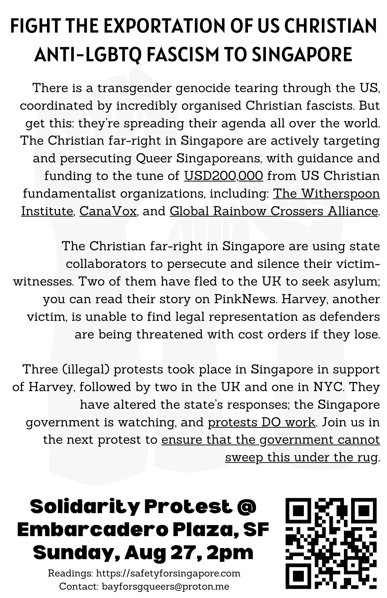

# San Francisco Protest
There is a protest against Operation High Tide in San Francisco. Sunday, 27 August, 2pm at Embarcadero Plaza. We urge you to share about and attend this protest in solidarity with queer people in Singapore, and to demand #Justice4Harvey, #Safety4Harvey, and Safety For Singapore.

Flyer text is below; links are added by us.

## FIGHT THE EXPORTATION OF US CHRISTIAN ANTI-LGBTQ FASCISM TO SINGAPORE

There is a transgender genocide tearing through the US, coordinated by incredibly organised Christian fascists. But get this: they're spreading their agenda all over the world. The Christian far-right in Singapore are actively targeting and persecuting Queer Singaporeans, with guidance and funding to the tune of <u>USD200,000</u> from US Christian fundamentalist organizations, including: <u>The Witherspoon Institute</u>, <u>CanaVox</u>, and <u>Global Rainbow Crossers Alliance</u>.

The Christian far-right in Singapore are using state collaborators to persecute and silence their victim-witnesses. Two of them have fled to the UK to seek asylum; you can read [their story on PinkNews](https://www.thepinknews.com/2023/07/14/singapore-lgbtq-queer-trans-asylum-attacks/). Harvey, another victim, is unable to find legal representation as defenders are being threatened with [cost orders if they lose](/#cost-orders-for-harveys-lawyer).

Three (illegal) protests took place in Singapore in support of Harvey, followed by [two in the UK](https://instagram.com/Safety4HarveyUK) and [one in NYC](https://instagram.com/Safety4HarveyUS). They have altered the state's responses; the Singapore government is watching, and <u>protests DO work</u>. Join us in the next protest to <u>ensure that the government cannot sweep this under the rug</u>.

**Solidarity Protest @ Embarcadero Plaza, SF**

**Sunday, Aug 27, 2pm**

Readings: https://safetyforsingapore.com

Contact: bayforsgqueers@proton.me

